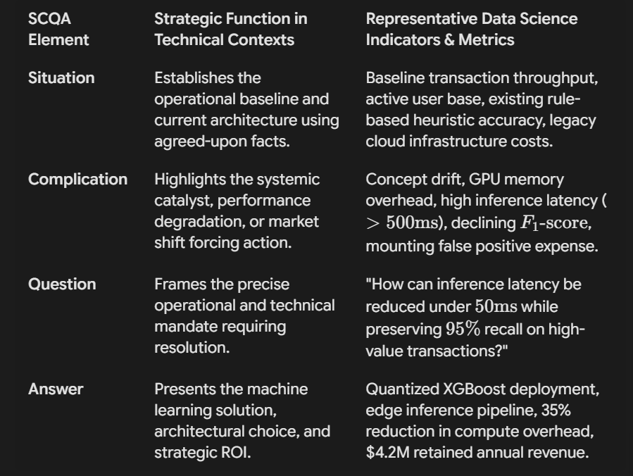
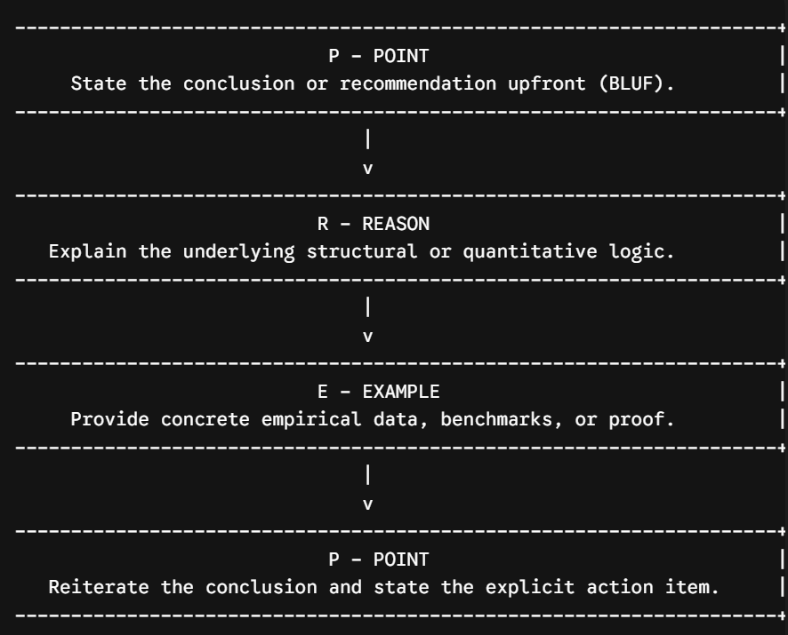
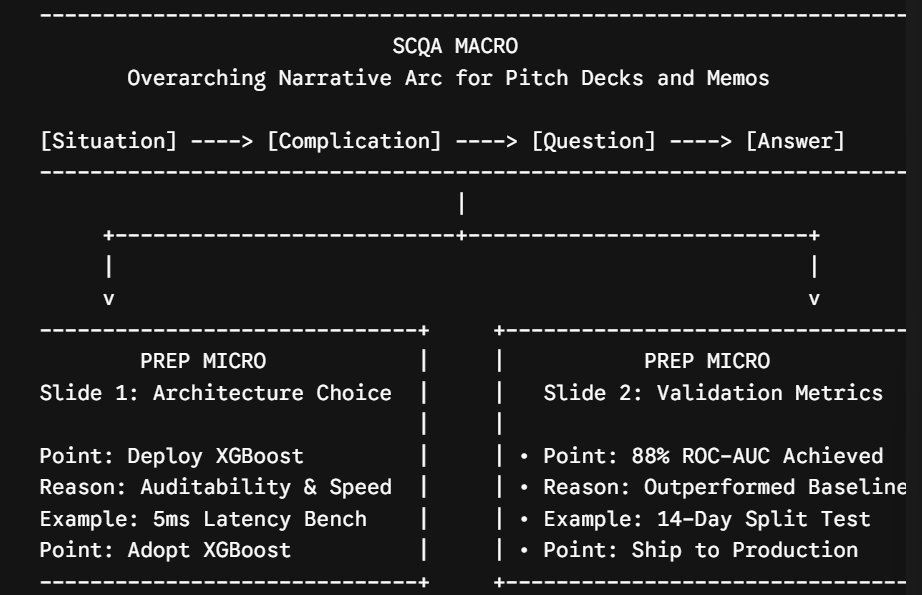
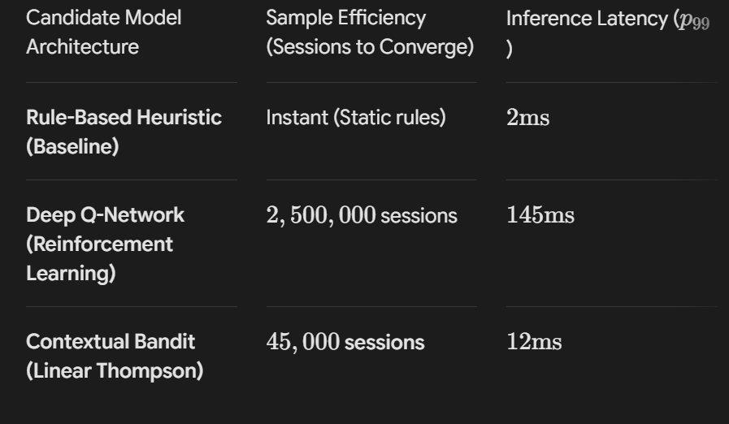

# Strategic communication frameworks In data sceicne and machine learning : Executive presentation methodologies Using SCQA and PREP 

The operational bottleneck in modern data-driven enterprises rarely stems from a lack of technical capability. Data science and machine learning teams routinely build highly accurate predictive models, scalable inference pipelines, and sophisticated neural architectures. However, these technical achievements frequently fail to secure executive buy-in or drive business transformation because of structural failures in technical communication. When data professionals present raw cross-validation scores, feature importance plots, or hyperparameter optimization logs without a clear narrative architecture, non technical stakeholders experience high cognitive load and decision fatigue.
 
To bridge this operational gap between complex quantitative engineering and strategic decision-making, structural communication frameworks offer repeatable mechanisms to translate technical output into clear, persuasive executive briefings. Two frameworls stand out for technical domains : the situation complication question answer(SCQA) narrative structure and The point reason example point(PREP) execution method. SCQA operates as a macro-level  narrative architecture designed to frame business problems, establish context and align  stakeholders around data science initiatives. PREP finctions as a micro level assertion structure designed to construct individual presentation slides, defend technical choices and structure real time answers during executive Q&A sessions. 

## Macro-Level Narrative Architecture: The Situation-Complication-Question-Answer (SCQA) Framework

Originating from Barbara Minto’s Pyramid Principle developed at McKinsey & Company, the SCQA framework organizes complex ideas into a top-down logical narrative. Technical presentations often fall into the trap of chronological reporting, where data scientists walk audiences sequentially through data ingestion, missing value imputation, exploratory data analysis, algorithm experimentation, and metric calculation. This bottom-up approach forces executives to mentally process disparate data points before understanding why the research was conducted. SCQA flips this structure by establishing immediate cognitive alignment through agreed-upon operational facts before introducing technical friction and recommendations.
 
The structural progression of SCQA follows a distinct narrative arc that transforms technical findings into strategic business imperatives. The narrative opens with the Situation, establishing a baseline of indisputable, recognizable context regarding current business operations, software architecture, or revenue streams. Once shared alignment is reached, the narrative introduces the Complication, which represents the critical catalyst, system failure, or environmental shift disrupting the baseline. In data science contexts, complications typically manifest as concept drift, unexpected revenue churn, system latency bottlenecks, rising false-positive costs, or scaling limitations.
 

This disruption naturally generates the Question, which crystallizes the explicit core problem statement that the organization must answer. The Question acts as a bridge between the business problem and the technical domain. Finally, the narrative delivers the Answer, presenting the proposed machine learning model, statistical pipeline, or architectural overhaul. The Answer does not merely state the algorithm used, but connects predictive capabilities directly to risk mitigation, cost reduction, or revenue capture.

##  Comprehensive Data Sciecne SCQA case studies : 
--- 
To understand how SCQA transforms technical communication, consider three common enterprise data science scenartios framed across macro-level narrative arcs. 
### Enterprise Customer Churn Mitigation
In an enterprise subscription telecommunications environment, the baseline Situation centers on an active subscriber base of 4.2 million users generating $68 million in quarterly recurring revenue, monitored by a legacy rule-based system that flags churn risks using static usage thresholds. The Complication arises as annual subscriber churn increases by 3.4 percentage points over consecutive quarters, resulting in an annualized revenue loss of $9.2 million. Internal post-mortems reveal that static rules fail to identify complex, non-linear behavioral signals, flagging users only after they have initiated cancellation proceedings.
 
This operational gap leads directly to the core Question: How can the data science team accurately identify high-risk churn patterns thirty days prior to cancellation while isolating the primary behavioral drivers to enable targeted intervention? The Answer presents a temporal Gradient Boosted Decision Tree (LightGBM) architecture integrated with SHAP (SHapley Additive exPlanations) interpretability modules. The model detects early churn indicators with an $88\%$ Area Under the Receiver Operating Characteristic curve ($\text{ROC-AUC}$), powering automated retention campaigns that project an annual net revenue recovery of $5.6 million.

### transitioning to graoh neural networks in fraud detection : 
Within financial technology operations, the baseline Situation involves a payments platform processing 15 million daily transactions through a deterministic rule engine that screens payments against static limits. The Complication emerges as organized fraud syndicates deploy distributed botnets and synthetic identity networks that easily bypass static thresholds, causing fraudulent chargebacks to rise by $42\%$ year-over-year. Simultaneously, rigid safety rules trigger excessive false positives, blocking $1.4 million in daily legitimate volume and damaging user trust.
 
The strategic Question asks how engineering can reduce false positive rates by $50\%$ while increasing overall fraud capture without exceeding the platform's strict $100\text{ms}$ real-time latency budget. The Answer proposes deploying a Heterogeneous Graph Neural Network (GNN) optimized for real-time inference via TensorRT execution engines. By evaluating relational topologies between account entities, IP subnets, and transaction histories, the GNN captures multi-hop fraud networks, delivering a $64\%$ reduction in false positives and increasing total fraud capture from $71\%$ to $93\%$ within an $18\text{ms}$ latency window.

### Retrieval-Augmented generation(RAG) for enterprise support engineering : 
In an industrial field engineering setting, the Situation describes a technical support department relying on a repository of 50,000 service manuals, schematic files, and maintenance logs. The Complication occurs because manual document retrieval averages 18 minutes per support ticket, and early attempts to fine-tune open-source Large Language Models (LLMs) yielded a $22\%$ hallucination rate on domain-specific engineering specs, creating legal and operational risks.
 
The operational Question asks how the platform team can deliver instant, factual technical guidance to field technicians while eliminating model hallucinations and preventing costly retraining cycles whenever service manuals are updated. The Answer details an enterprise Retrieval-Augmented Generation (RAG) architecture pairing a dense vector database using Hierarchical Navigable Small World (HNSW) indexing with an instruction-tuned LLM constrained by strict context-grounding prompts. The system reduces response times to under 12 seconds per query, achieves $99.2\%$ factual precision, and lowers operational support costs by $3.1 million annually.

## Micro level assertion architecture : The point reason example point (PREP) Framework
While SCQA organizes the overall narrative deck, the PREP framework (Point, Reason, Example, Point) provides a micro-level structure for individual slides, technical trade-off discussions, and real-time responses during presentation Q&A. PREP is an assertion-driven structure rooted in the Bottom Line Up Front (BLUF) principle. It directly counters the academic tendency to hide key findings behind long methodological explanations.
 
The mechanics of PREP require the presenter to state the core conclusion or recommendation immediately in the opening Point. This gives the audience a clear contextual lens to interpret the following technical details. Next, the Reason provides the structural, logical, or quantitative justification supporting the initial claim. The Example then presents concrete empirical proof, cross-validation metrics, or benchmark data that validates the reason. Finally, the closing Point restates the core conclusion, connecting it directly to an actionable next step or operational decision.

## Comprehensive data science PREP case examples : 
the following examples demonstrate how PREP structures technical explanations, slide designs and executive communications. 

### Model selection (Interpretable tree ensembles vs black box deep learning): 
The opening Point asserts that the data science team recommends deploying a Tree-Based Ensemble (XGBoost) with SHAP feature attributions rather than a Deep Neural Network for credit underwriting decisions. The Reason highlights that fair lending regulations require explicit, auditable explanations for adverse credit decisions, which deep neural networks cannot guarantee deterministically. Additionally, XGBoost handles heterogeneous tabular data efficiently without requiring complex synthetic oversampling.
 
The Example highlights cross-validation results on 500,000 historical loan applications, where XGBoost achieved an $F_1\text{-score}$ of $0.842$ compared to the Deep Neural Network's $0.849$. Crucially, XGBoost generated deterministic local feature attributions within $5\text{ms}$ per evaluation, whereas neural attribution methods showed unstable gradient variance across demographic subgroups. The closing Point confirms that adopting XGBoost ensures complete regulatory compliance and model interpretability while retaining over $99\%$ of optimal predictive performance.

### Data preprocessing and Automated pipeline engineering : 
The opening Point recommends transitioning from manual feature engineering scripts to an automated, centralized Feature Store with continuous data validation. The Reason explains that uncoordinated manual feature calculations across training and inference pipelines introduce training-serving skew and data leakage, causing production performance degradation.
 
The Example cites a recent production incident where an offline model evaluated on manually preprocessed historical data projected a $14\%$ lift in conversion. However, post-deployment monitoring showed zero live conversion lift because the online microservice calculated rolling averages over a 24-hour window, whereas the offline training script mistakenly computed the window over 30 days. The closing Point reiterates that deploying an automated feature store eliminates training-serving skew, guarantees feature consistency, and cuts feature deployment timelines from three weeks to two days.

### Statistical Drift Detection vs Calendar based model retraining : 
The opening Point states that production machine learning models should be retrained based on dynamic statistical drift triggers rather than a fixed monthly schedule. The Reason notes that static schedules either burn cloud compute needlessly during stable periods or allow performance degradation during sudden market shifts.
 
The Example points to a macroeconomic shift where consumer purchasing patterns changed abruptly over 48 hours. Because model retraining was scheduled monthly, the demand forecasting model suffered a $32\%$ increase in Mean Absolute Percentage Error ($\text{MAPE}$) over two weeks before the scheduled retrain ran, causing an estimated $450,000 in inventory stockouts. The closing Point confirms that implementing automated Kolmogorov-Smirnov drift triggers will execute retraining only when feature distributions shift significantly, preserving forecast accuracy while optimizing compute expenses.

### A/B Testing Evaluation for Recommendation Engine Rollout
The opening Point advises an immediate enterprise-wide rollout of Model v2.4 to replace the baseline recommendation engine. The Reason explains that Model v2.4 achieved statistically significant lifts across primary conversion metrics, driven by a novel contextual multi-armed bandit algorithm that resolves item cold-start issues.
 
The Example shares data from a 14-day online split test across 200,000 randomized user sessions, where Model v2.4 achieved a $6.8\%$ lift in Click-Through Rate ($\text{CTR}$, $p < 0.001$) and an $8.2\%$ increase in Average Order Value ($\text{AOV}$), generating $182,000 in incremental test-period revenue. The closing Point recommends immediately shifting $100\%$ of production traffic to Model v2.4 to maximize platform revenue while staying within latency budgets.

### Structural Alignment: Integrating SCQA Macro-Storytelling with PREP Micro-Assertions
SCQA and PREP are not mutually exclusive; they operate at different structural levels of a presentation. SCQA provides the macro-level outline for an entire pitch deck, project proposal, or executive update, building narrative tension and aligning business strategy with technical solutions. Within that overarching arc, PREP structures the individual slides and technical arguments, ensuring every slide delivers a clear, evidence-backed point.

undestanding how SCQA and PREP complement each other allows technical leaders to choose the right framework for different communication scenarios across an enterprise : 
| **Operational Dimension** | **SCQA Framework** | **PREP Framework** |
|---|---|---|
| **Structural Level** | **Macro-Level:** Overarching narrative arc for pitch decks, project charters, and strategic proposals. | **Micro-Level:** Structural framework for individual slides, supporting arguments, and Q&A responses. |
| **Primary Objective** | Aligns cross-functional stakeholders, frames complex business problems, and justifies ML investments. | Delivers rapid clarity, defends specific technical choices, and drives focused decisions. |
| **Target Audience** | Executive leadership (C-Suite, VPs, Board of Directors), business unit managers. | Technical directors, engineering leads, peer data scientists, project managers. |
| **Cognitive Framing** | Narrative tension and resolution; establishes shared context before introducing technical proposals. | Bottom-Line-Up-Front assertion; leads with the answer to minimize cognitive load. |
| **Data Science Context** | Business case proposals, legacy infrastructure overhauls, AI product roadmaps. | Algorithm selection defense, hyperparameter trade-offs, baseline metric comparisons. |
| **Delivery Format** | Multi-slide executive decks, strategic investment memos, project kickoff presentations. | Individual slides, stand-up updates, impromptu executive Q&A, technical design reviews. |

## Executive Deck architecture and Impromptu defense strategies : 
To implement these frameworks in an executive presentation, the presenter should use SCQA to structure the overall deck while applying PREP to design every supporting slide 

## END TO END PRESENTATION DECK ARCHITECTURE : 
### Macro structure : 

- slide 1 : Title&Executive Summary : 
     - headline : real time personalization platform : scaling customer LTV via Edge Inference
- slide 2 : The situation(Agreed baseline context):
    - Content : The platform processes 120 million $ in annual e-commerce volume; conversion sits at 2.1% using batch-processed recommendations computed nightly.

- slide 3 : The complication(System catalyst&tenstion)
    - content : batch recommendations fail to reflect intra-session intent shifts, causing a 15% drop in conversion during sessions longer than five minutes.
- slide 4 : The Strategic Question 
    - content : How can engineering deliver real-time recommendations under 30ms without ballooning cloud infrastructure costs ? 
- slide 5: The strategic answer 
    - content : Deploy an on-device contextual bandit model via ONNX runtime, projecting a $4.2M net revenue lift at zero added server compute cost.

### technical execution slides(Micro Prep Structure)

- slide 6: Model Architecture selection(Prep Slide)
    - Point: we recommend deploying contextual multi-armed bandits over deep reinforecement learning
    - Reason: Contextual bandits sample actions efficiently with low sample complexity, avoiding the stability issues and cold-start data requirements of full Deep RL pipelines.
    - Example: Empirical benchmark data demonstrates model convergence and inference latency across candidate algorithms.
    - Point: Contextual bandits provide fast online convergence within latency budgets.
    

- slide 7 : infrastructure Optimization (PREP slide)
    - Point : Model quantization reduces inference latency by 75% without sacrificing prediction accuracy.
    - Reason: Converting FP32 matrices to INT8 precision resolves memory bandwidth bottlenecks during matrix multiplication on edge devices.
    - Example: Benchmark tests show $p_{99}$ latency dropping from $48\text{ms}$ to $11.2\text{ms}$ while preserving $99.4\%$ top-k item hit-rate.
    - Point: Quantization enables real-time edge execution within budget constraints

### Managing Impromptu Executive Q&A with PREP
During technical presentations, executive Q&A sessions can derail speakers who lack a structured communication method. When executives ask unexpected questions about model degradation, operational safety, or infrastructure expenses, presenters should use PREP to deliver concise, data-backed answers. 
Consider a scenario where an executive asks: "What happens to our operational revenue if your machine learning model misinterprets a sudden shift in consumer behavior during peak holiday sales?" 
A structured response using PREP addresses the concern directly:
- Point: We have engineered an automated fallback mechanism that routes traffic to our baseline engine if model confidence drops below safety thresholds.
- Reason: Machine learning models struggle when live data distributions drift outside their training space. Automated fallback guarantees system stability, preventing bad predictions during unexpected traffic spikes.
- Example: During stress testing of a 300% simulated traffic spike with novel product categories, the anomaly monitor detected out-of-distribution drift within 90 seconds. The gateway automatically shifted traffic to the fallback engine, preserving baseline conversion and preventing an estimated $120,000 revenue drop.
- Point: This automated safeguard ensures zero downside revenue risk during unexpected market anomalies.

## Strategic Synthesis and Organizational Impact
Mastering technical presentation delivery requires moving away from method-heavy, chronological reports. Instead, data science leaders must adopt clear narrative frameworks that connect technical work directly to business value.
 
Using SCQA at the macro level ensures data science projects are anchored in business realities, framing technical challenges around core operational questions and driving measurable results. Simultaneously, applying PREP at the micro level gives individual slides, feature trade-off discussions, and Q&A answers clear focus, supporting every claim with quantitative proof.
 
By pairing SCQA's strategic framing with PREP's concise execution, data science teams can bridge the gap between complex quantitative engineering and executive decision-making. This structural alignment ensures advanced analytical models secure the cross-functional support, resources, and production deployment needed to deliver enterprise value.