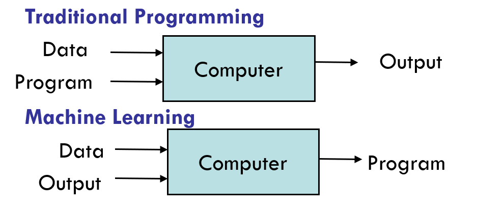
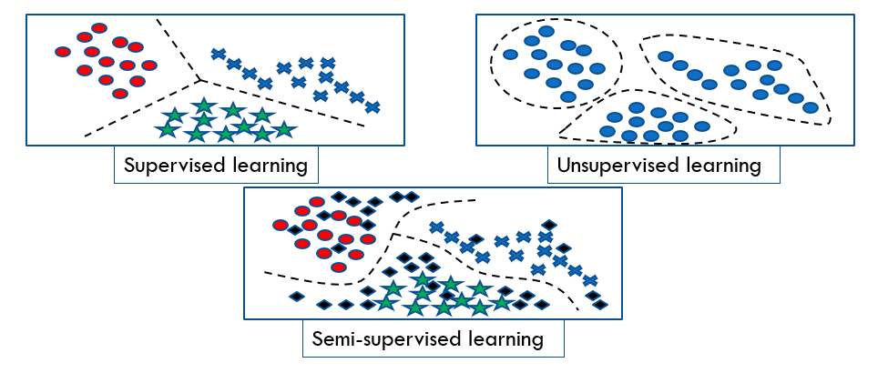
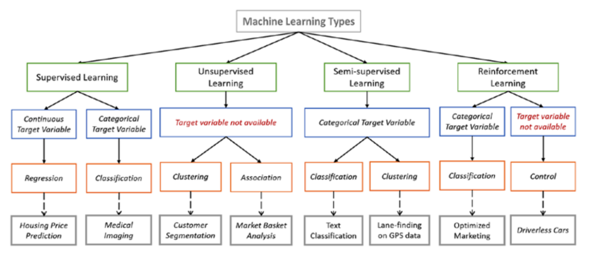
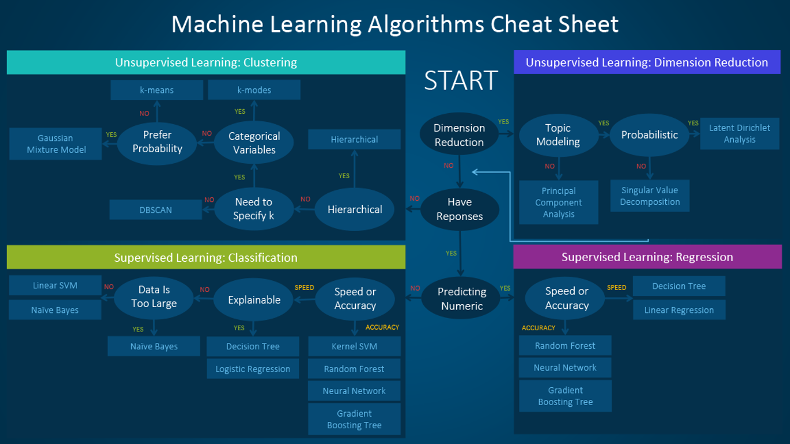
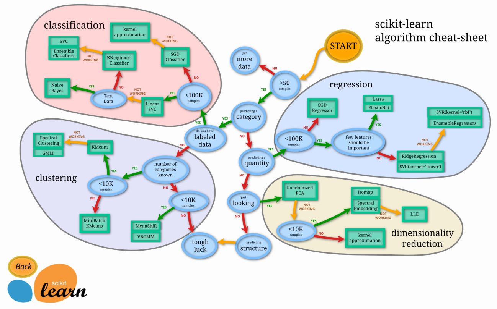
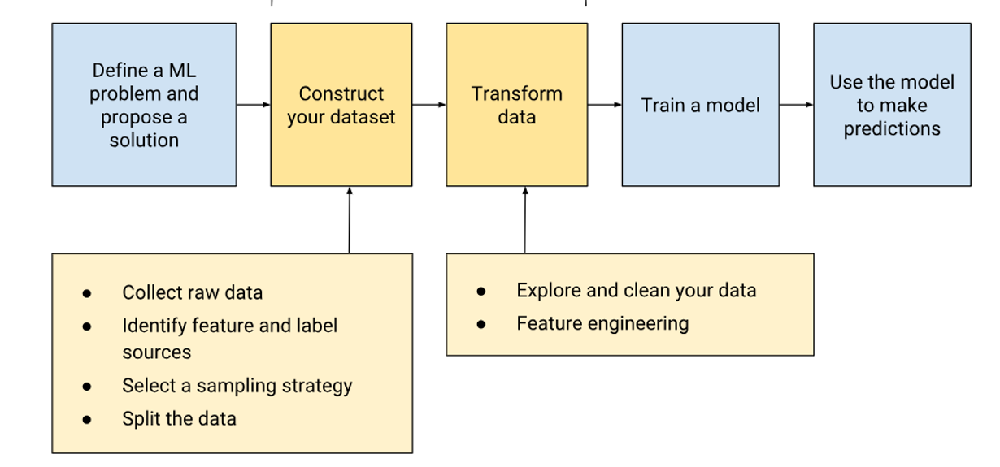
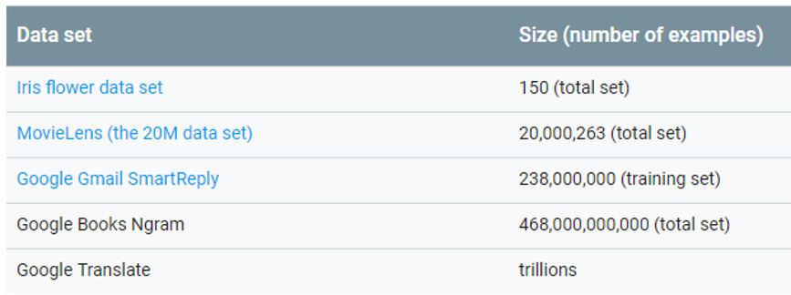

# Machine learning 

### Introduction : 

- Data is cheap and abundant (data warehouses , data marts) , the knowledge is expensive and scarce. 
- Build a model that is good and useful approximation to the data. 
- A branch of artificial intelligence, concerned with the design and development of algorithms that allow computers to evolve behaviors based on empirical data.
- As intelligence requires knowledge, it is necessary for the computers to acquire knowledge.

- The image above illustrates a very useful concept. There are some problems in the IT world that are difficult or even impossible to solve by explicitly writing rules in code, such as image recognition. The solution we have today is to train a machine learning model on data, allowing it to learn patterns and relationships and effectively create its own algorithm for making predictions.
- So what is Machine learning ? is the study of algorithms that improve their performances at some task with experience
- training is the process of making the system able to learn. 
- The success of Machine learning system depends also on the algorithm used , the algorithm control the search to find and build the structure of knowledge.
- the algorithm should extract some useful informations from the training data.
- Algorithm : Supervised Learning - Unsupervised learning - Semi supervised learning and Reinforcement learning.
 
 - ML in nutshell : tens of thousands of ML algorithm, hundrends new each year , Every machine learning algorithm has 3 components : the presentation , the evaluation and the optimization. 
 - Representation :Decision trees
 Sets of rules / Logic programs
 Instances
 Graphical models (Bayes/Markov nets)
 Neural networks
 Support vector machines
 Model ensembles
 Etc.
 - Evaluation : Accuracy
 Precision and recall
 Squared error
 Likelihood
 Posterior probability
 Cost / Utility
 Margin
 Entropy
 K-L divergence
 Etc.
 - Optimization : Combinatorial optimization
 E.g.: Greedy search
 Convex optimization
 E.g.: Gradient descent
 Constrained optimization
 E.g.: Linear programming
 

 ## Steps of developing a machine learning application : 
1. Collect the data
2. prepare the input data 
3. analyze the input data
4. filter the garbage
4. train the model on the data
5. test the model 
6. Use the model 

## 1. Data preparation : 

### Steps to construct your data 
- to construct your dataset (and before doing data transformation), you should :
1. Collect raw data 
2. Identify feature and label sources 
3. Select a sampling strategy 
4. Split the data
- These steps depend a lot on how you’ve framed your ML problem. Use the self-check below to refresh your memory about problem framing and to check your assumptions about data collection.
- For me : Pick as many features as you can, so you can start observing which features have the strongest predictive power.
- Garbage in , garbage out -> at the enf your model is as good as your data is .

## how to measure the data quality to improve it ? 
### Size of the dataset : 
---
- As a rough rule of thumb, your model should train on at least an order of magnitude more examples than trainable parameters. Simple models on large data sets generally beat fancy models on small data sets. 
 
- it is no matter only of having a lot of data,  quality matters too 
### quality of data : 
- when you are collecting the data , you must define the term "quality" for your data.Certain aspects of quality tend to correspond to better-performing models:
1. reliability : measures the degree to which you trust your data, a model trained on a reliable data is most likely to yield a mode useful predictions than a model trained on unreliable data. In measuring reliability , you must determine : 
- how common are label errors ? for example , if your data is labeled by humans , sometimes humans make mistakes.
- are your features noisy ? for example GPS measurements fluctuate, some noise is okay. Youll never purge your data set of all noise. You can collect more examples too.
- Is the data properly filtered for your problem ? for example should your data set include search queries from bots ? if you re building a spam detection system then likely the answer is yes but if you re trying to improve search results for humans then no. 
<b>
what makes data unreliable : 
- examples : 
- Comitted values , for instance a person forgot to enter a value for house age
- Duplicate examples, a server mistakenly uploaded the same record twice 
. bad labels : for instance , a person mislabeled a picture of an aak traa as a maple 
- bad feature values, for example someone typed an extra digit or a thermometer was left out in the sun. 
2. feature representation :
- Representation is the mapping of data to useful features. You'll want to consider the following questions : 
- how is data shown to the model ? 
- should you normalize numeric values ? 
- how should you handle outliers ? 

3. minimizing skew
- the results work well offline , then in your live experiment , those results dont hold up ! what could be happening ? 
- this problem suggests training/serving skew - that is different results are computed for your metrics at training time vs serving time. 
- causes of skew can be subtle but have deadly effects on your results. always consider what data is available to your model at preiction time. During training , use only the features that youll have available in serving , and make sure that your training set is representative of your serving traffic. 

## Identifying labels and sources 
### Direct vs Derived Lables 
- machine learning is easier when your label is well defined
- the ebst label is the direct label : "is the user a fan of Taylor swift"
- derived label : user has watched a taylor swift video on youtube , your model will be as good as the connection between your derived label and your desired prediction.
### label sources : 
- the output of your model could be either an event or an attribute. this results in the following two type of labels : 
1. Direct label for events : such as "did the used click the top search result ? "
2. Direct label for attributes: such as "will the advertiser spend more than &X in the next week? "

### why use human labeled data  ? 
- there are advantages and disadvantages to using human labeled data : 
- + : Human raters can perform a wide range of tasks.
- the data forces you to have a clear problem definition
- - : the data is expensive for cetrain domains 
- Good data typically requires multiple iterations.
