# Machine learning 

### Introduction : 

- Data is cheap and abundant (data warehouses , data marts) , the knowledge is expensive and scarce. 
- Build a model that is good and useful approximation to the data. 
- A branch of artificial intelligence, concerned with the design and development of algorithms that allow computers to evolve behaviors based on empirical data.
- As intelligence requires knowledge, it is necessary for the computers to acquire knowledge.

- The image above illustrates a very useful concept. There are some problems in the IT world that are difficult or even impossible to solve by explicitly writing rules in code, such as image recognition. The solution we have today is to train a machine learning model on data, allowing it to learn patterns and relationships and effectively create its own algorithm for making predictions.
- So what is Machine learning ? is the study of algorithms that improve their performances at some task with experience
- training is the process of making the system able to learn. 
- The success of Machine learning system depends also on the algorithm used , the algorithm control the search to find and build the structure of knowledge.
- the algorithm should extract some useful informations from the training data.
- Algorithm : Supervised Learning - Unsupervised learning - Semi supervised learning and Reinforcement learning.
 
 - ML in nutshell : tens of thousands of ML algorithm, hundrends new each year , Every machine learning algorithm has 3 components : the presentation , the evaluation and the optimization. 
 - Representation :Decision trees
 Sets of rules / Logic programs
 Instances
 Graphical models (Bayes/Markov nets)
 Neural networks
 Support vector machines
 Model ensembles
 Etc.
 - Evaluation : Accuracy
 Precision and recall
 Squared error
 Likelihood
 Posterior probability
 Cost / Utility
 Margin
 Entropy
 K-L divergence
 Etc.
 - Optimization : Combinatorial optimization
 E.g.: Greedy search
 Convex optimization
 E.g.: Gradient descent
 Constrained optimization
 E.g.: Linear programming
 

 ## Steps of developing a machine learning application : 
1. Collect the data
2. prepare the input data 
3. analyze the input data
4. filter the garbage
4. train the model on the data
5. test the model 
6. Use the model 

## 1. Data preparation : 

### Steps to construct your data 
- to construct your dataset (and before doing data transformation), you should :
1. Collect raw data 
2. Identify feature and label sources 
3. Select a sampling strategy 
4. Split the data
- These steps depend a lot on how you’ve framed your ML problem. Use the self-check below to refresh your memory about problem framing and to check your assumptions about data collection.
- For me : Pick as many features as you can, so you can start observing which features have the strongest predictive power.
- Garbage in , garbage out -> at the enf your model is as good as your data is .

## how to measure the data quality to improve it ? 
### Size of the dataset : 
---
- As a rough rule of thumb, your model should train on at least an order of magnitude more examples than trainable parameters. Simple models on large data sets generally beat fancy models on small data sets. 
 
- it is no matter only of having a lot of data,  quality matters too 
### quality of data : 
- when you are collecting the data , you must define the term "quality" for your data.Certain aspects of quality tend to correspond to better-performing models:
1. reliability : measures the degree to which you trust your data, a model trained on a reliable data is most likely to yield a mode useful predictions than a model trained on unreliable data. In measuring reliability , you must determine : 
- how common are label errors ? for example , if your data is labeled by humans , sometimes humans make mistakes.
- are your features noisy ? for example GPS measurements fluctuate, some noise is okay. Youll never purge your data set of all noise. You can collect more examples too.
- Is the data properly filtered for your problem ? for example should your data set include search queries from bots ? if you re building a spam detection system then likely the answer is yes but if you re trying to improve search results for humans then no. 
<b>
what makes data unreliable : 
- examples : 
- Comitted values , for instance a person forgot to enter a value for house age
- Duplicate examples, a server mistakenly uploaded the same record twice 
. bad labels : for instance , a person mislabeled a picture of an aak traa as a maple 
- bad feature values, for example someone typed an extra digit or a thermometer was left out in the sun. 
2. feature representation :
- Representation is the mapping of data to useful features. You'll want to consider the following questions : 
- how is data shown to the model ? 
- should you normalize numeric values ? 
- how should you handle outliers ? 

3. minimizing skew
- the results work well offline , then in your live experiment , those results dont hold up ! what could be happening ? 
- this problem suggests training/serving skew - that is different results are computed for your metrics at training time vs serving time. 
- causes of skew can be subtle but have deadly effects on your results. always consider what data is available to your model at preiction time. During training , use only the features that youll have available in serving , and make sure that your training set is representative of your serving traffic. 

## Identifying labels and sources 
### Direct vs Derived Lables 
- machine learning is easier when your label is well defined
- the ebst label is the direct label : "is the user a fan of Taylor swift"
- derived label : user has watched a taylor swift video on youtube , your model will be as good as the connection between your derived label and your desired prediction.
### label sources : 
- the output of your model could be either an event or an attribute. this results in the following two type of labels : 
1. Direct label for events : such as "did the used click the top search result ? "
2. Direct label for attributes: such as "will the advertiser spend more than &X in the next week? "

### why use human labeled data  ? 
- there are advantages and disadvantages to using human labeled data : 
- + : Human raters can perform a wide range of tasks.
- the data forces you to have a clear problem definition
- - : the data is expensive for cetrain domains 
- Good data typically requires multiple iterations.

## Sampling and splitting the data : 
- it's ofren a struggle to gather enough data for a machine learning project and sometimes you got much data and you must select a subset of examples of training.
- How do you select that subset ? 
- example of google search. At what granularity would you sample its massive amounts of data? would you use random queries ? random sessions ? random users? 
- the answer depends on the problem: what do you want to predict, and what features do you want ? 

### Imbalanced data : 
- a classification dataset with skewed class proportions is called imbalances. Classes that make up a large proportion of the data set are called majority classes. Those who make up the small part are called the minority classes.

- what called as imbalanced ? The answer could range from mild to extreme, as the table below shows : 
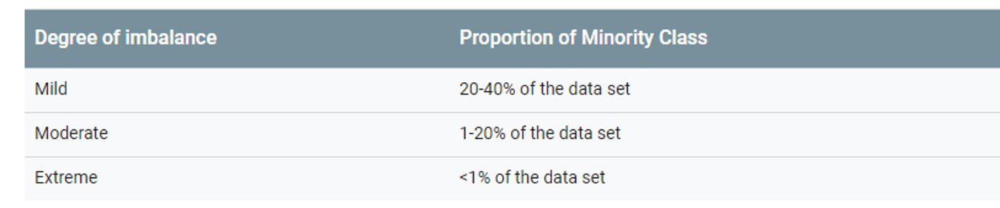
### why to look out for imbalancecd data ? 
- consider the following example : a model that detect fraud , instances of fraud happen once per 200 transactions in this data set , so in the true distribution about 0.5 percent of the data is positive 
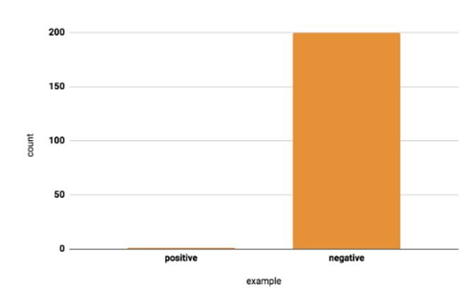
- why would this problematic ? 
- with so few positives relative to negatives , the training model will spend most of its time on negative examples and not learn enough from positive ones. 
- if you have imbalanced data set , first try training on the true distribution.If the model works well and generalizes, you're done ! if not try the following techniques : 
### Downsampling and Upweighting : 
- An effective way to handle imbalanced data is to downsample and upweight the majority class. Let's start by defining those two new terms : 
- *Downsampling* : means training on a disproportionately low subset of the majority class examples 
- *Upweighting* means addingg an example weight to the downsampled class equal to the factor by which you downsampled.

### step 1 : downsample the majority class _ 
- consider again our example of fraud dataset with 1 positive to 200 negatives. We can downsample by a factor of 20 , taking 1/10 negatives , now about 10 % of our data is positive , which will be much better for training our model. 
### step 2 : upweight the downsampled class 
- the last step is to add example weights to t he downsampled class . Since we downsampled by a factor of 20, the exampe weight should be 20 
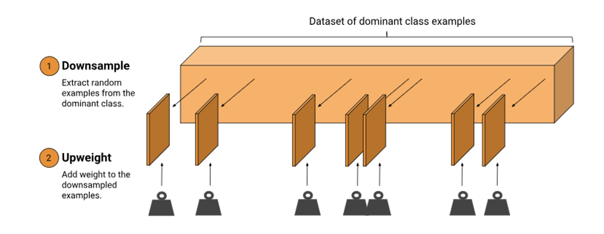

### weights : 
- here we're talking about example weights, which means counting an individual example more importantly during training. An example weight of 10 means the model treats the examples as 10 times as important (when computing loss) as it would an example of weight 1. 
- the weight should be equal to the factor you used to downsample : example weight= origin example weight x downsampling factor 
### why downsampling and upweight ? 
- it may seem odd to add example weights after downsampling. We were trying to make our model improve on the minority class -- why would we upweight the majority ? these are the resulting changes : 
1. faster convergence : during training, we see the minority class more often , which will help the model converge faster.
2. Disk space : By consolidating the mojority class into fewer examples with larger weights, we spend less disk space storing them. this saving allows more disk space for the minority class . so we can collect a greater number and a wider range of examples from that class 
3. Calibration:  Upweighting ensures or model is still calibrated , the outputs can stoll be interpreted as probabilites

### Datasplitt examples : 

- after  collecting your data and sampling where needed, the next step is to split your data into training sets, validation sets and testing sets 

### why random splitting isnt the best approach 
- while it is the best approach for many ML problems. it isnt always the right solution
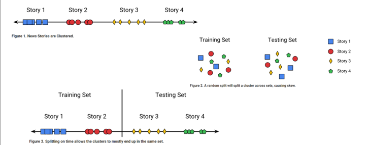
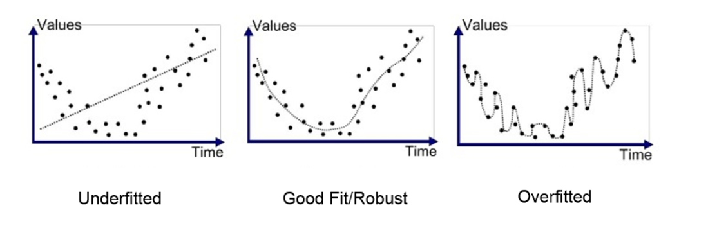
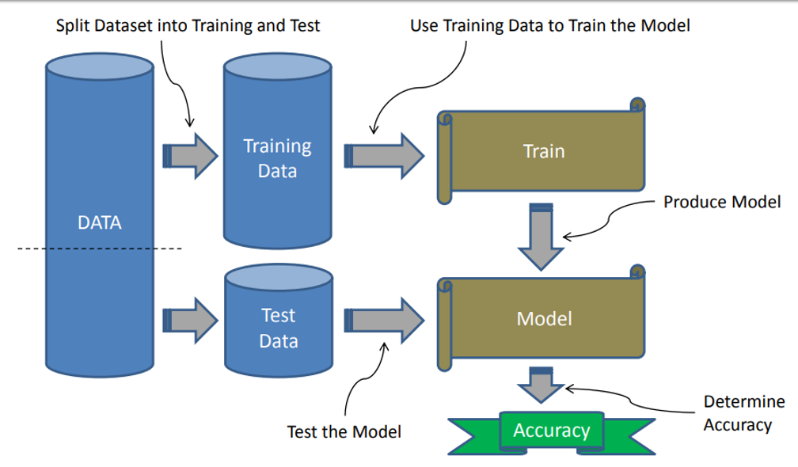

### imbalanced data -- overfitting : 
- if the training data is overly imbalanced, then the model will predict a non meaningful result -> this is called *Overfitting* 
- to prevent overfiting there needs to be a fairly equal distribution of training samples for each classification, or range if label is a real value. 
### overfitting : 
- in data science courses, overfit model is explained as having high variance and low bias on the training set which leads to poor generalization on new testing data. 

### how to limit overfitting 
- Both overfitting and underfitting can lead to poor model performance. But by far the most common problem in applied machine learning is overfitting. 
- overfitting is such a problem because the evaluation of machine learning algorithms on training data is different from the evaluation we actually care the most about, namely how well the algorithm well perform on unseen data.

### how to limit overfitting : 
- there are two important techniques that you can use : 
1. Use a resampling technique to estimate the model accuracy.
2. Hold back a validation test 

### underfitting :
- refers to a model that can neither model the training data or to generalize to new data. 
- an underfit machine learning model is not a suitable model and will be obvius as it will have poor performance on the training data. 

# Basic :
Machine learning must  seem complex but it is really built out of a series of basic building blocks : 
- overfitting : too much reliance on the training data
- underfitting : a failure to learn the relationships in the training data
- High variance : model changes significantly based on the training data
- High bias : assumption about model lead to ignoring training data
- Overfitting and underfitting cause poor generalization on the test set 
- a validation set for model tuning can prevent under and overfitting. 
- ...

# FEATURE ENGINEERING : 

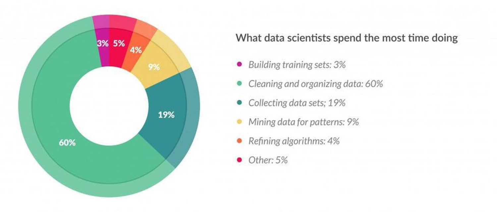
Feature engineering is the art/science of representing the data the best way possible for a problem, Good feature engineering involves an elegant blend of domain knowledge , intuition and basic mathematical abilities 
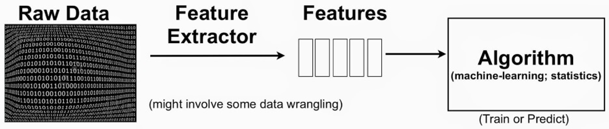

### what best ? 
---
- the way yoy present your data in essence should denote the pertinent structures/properties of the underlying information in the most effective way possible. When you do feature engineering, you are essentially converting your data attributes into data features.

### Attributes : 
---
- Attributes are basically all the dimensions present in your data. But do all of them , in the raw format , represent the underlying tends you want to learn in the best way possible ? maybe not 

### Features : 
---
- so what you do in feature engineering is pre process your data so that your model algorithm has to spend minimus effort on wading through noise.
- noise is any information that is not relevant to learning/predicting your ultimate goal. 
- In fact using good features can even let you use considerably simpler models.

- as with any technique in machine learning , always use validation to make sure that the new features you introduce really do improve your predictyions, instead of adding unecessary complexity to your pipeline.

### decomposing categorical attributes: 
why ?
- since ML is based on mathematical equations, it would cause a problem when we keep categorical variables as is. 
 
*encoding methodologies* :
- Nominal encoding : where order of the data does not matter 
- Ordinal encoding : where the order of the data does matter 

1. One hot encoding. 
2. bel Encoding 
3. Ordinal Encoding 
4. Helmert Encoding 
5. Binary Encoding
6. Frequency Encoding
7. Mean Encoding
8. Weight of Evidence Encoding
9. Probability Ratio Encoding
10. Hashing Encoding
11. Backward Difference Encoding
12. Leave One Out Encoding
13. James-Stein Encoding
14. M-estimator Encoding

## Binning / Bucketing : 
---
- sometimes , it makes more sense to represent a numerical attribute as a categorical one. 
- example : consider a problem where preficting whether a person owns a certain item of clothing or not.
- age might definitely be a factor here. what actually more pertinet is the age group 
- 1-10 , 11-18,19-25,26-40 ...

### binning : 
- binning or grouping data is an important tool in preparing numerical data for machine learning 

- binning also reduces the effect of tiny errors by rounfing off a given value to the nearest representative. 
- Binning does not make sense if the number of your ranges is comparable to the total possible values, or if precision is very important to you. 

### Bucketing
- bucketing makes sense when the domain of your attribute can be divided into neat ranges, where all numbrs falling in a range imply a common characteristic 
- it reduces overfitting in certain applications. 
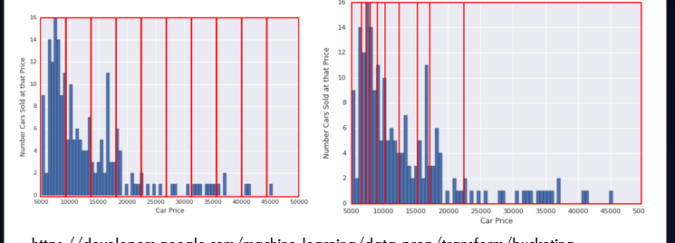

# BIG PARTT TO BE ADD HERE LATER ! 

# Machine learning algorithms : 
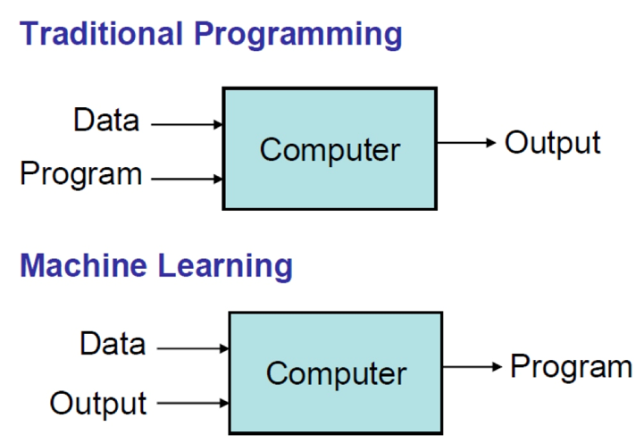

## LINEAR REGRESSION : 
- it is used to estimate real values (target variable) based on continuous variable(s).
- Linear Regression is used for finding learning relationship between target and one or more predictors. 
- The core idea is to obtain a line that best fit the data. 
- the best fit line is the one for which total prediction error are as small as possible, error is the distance between the real value and the predicted one. 
- Establish relationship between independent and dependent variables by fitting a best line. This best fit line is known as regression line and represented by a linear equation Y=a*X+b.
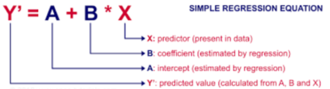
### Types of linear regression : 
--- 
- simple linear regression 
- multiple linear regression 

### 1 - simple linear regression 
---
- single dimension linear regression has one prediction and one target as input for the training simple. 
- it uses these training sample to derive a line that predict values of y. 
- the training sample are used to derive the values of a and b that minimise the error between actual and predicted values of y.
- a is the slope and b is the y-intercept. 
- dataset -> algo ML -> Function h(x)
- this function will receive later x and give y.
- as been mentionned before we want a line that minimises the error between the Y values in the trainingg samples and the h(x) values that the line passes through. 
- so we define the error function for our algorithm so we can minimise that error. 
### cost function : 
- the cost function helps us figure out the best possible values for a and b which would provide the best fit line for the data points- 
- since we want the best values for a and b , we convert this search problem into a minimization problem where we would like to minimize the error between the predicted value and the actual value. 
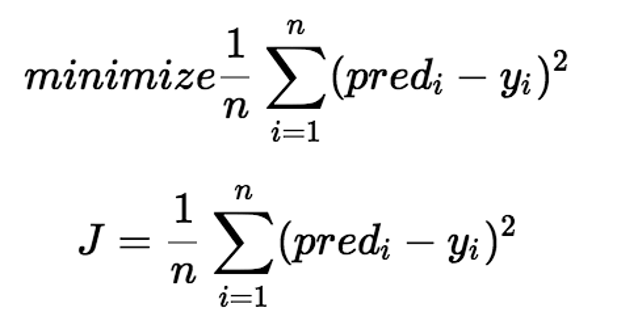

### minimize the error : 
--- 
- the values a and b must be chosen so that they minimize the error. If sum of squared error is taken as a metric to evaluate the model, then the goal to obtain a line that best reduces the error. 
- Mean absolute error is the mean of the absolute value of errors 
- Mean square error is the mean of the squared error  
- Mean Absolute Percentage Error  
- Mean percentage Error
- Root Mean Squared Error (RMSE) is the square root of the mean of the squared errors.

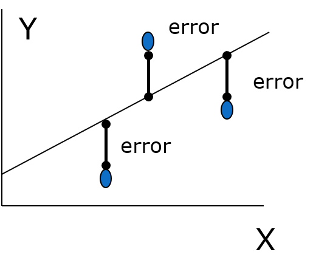

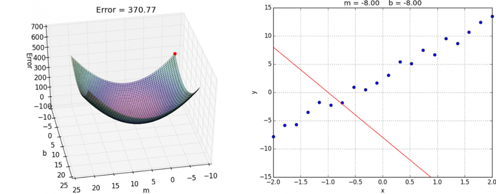

### how ?
---
- to determine how to best fit our model with given set of points, we want to minimize the distance between each of these point to our linear model.
- calculating the totalError helps us determine how bad our model is so we can update it every step
- but ... 
### Minimizing the cost function : Gradient Descent 
- Repeat until convergence:
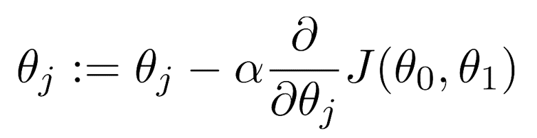
- partial derivative
- the derivative of a function of a real variable measures the sensitivity to change of the function value(output value) with respect to a change in its argument(input value)
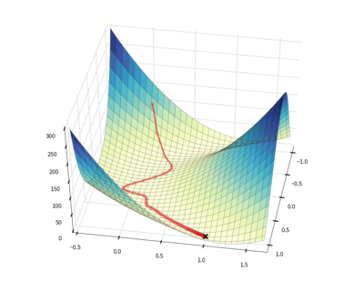
- *slope*
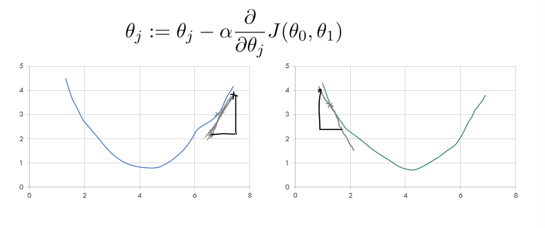
- Learning rate : 
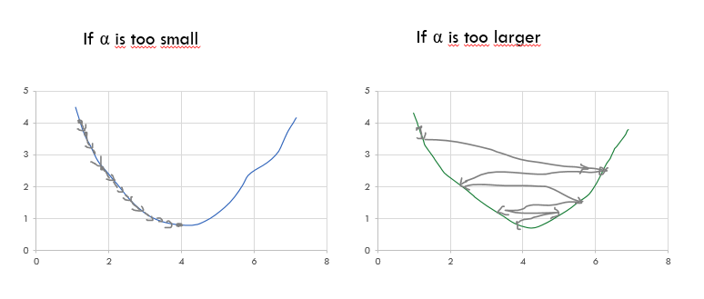
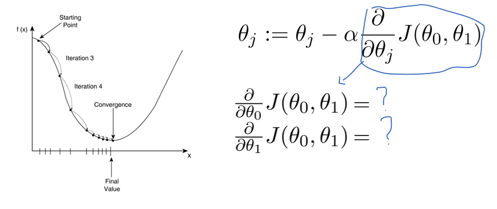
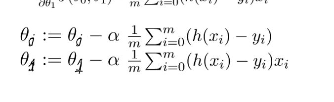

## Multi dimension linear regression : 

- Each training sample has an x made up of multiple input values and a corresponding y with a singe value 
- the inputs can be presented as an X matric in which row is sample and each column is a dimension. 
- the outputs can b e represented as y matrix in which each row is a sample 
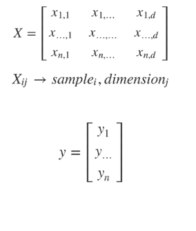
### basic layout : 
- our predicted y value are calculated by multiplying the X matrix by a matrix of param , ϴ. 
- if there are 2 dimension, then this equation defines plane, if there are mode dimension then it define hyperplane. 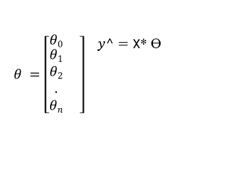

## Logistic Regression : 
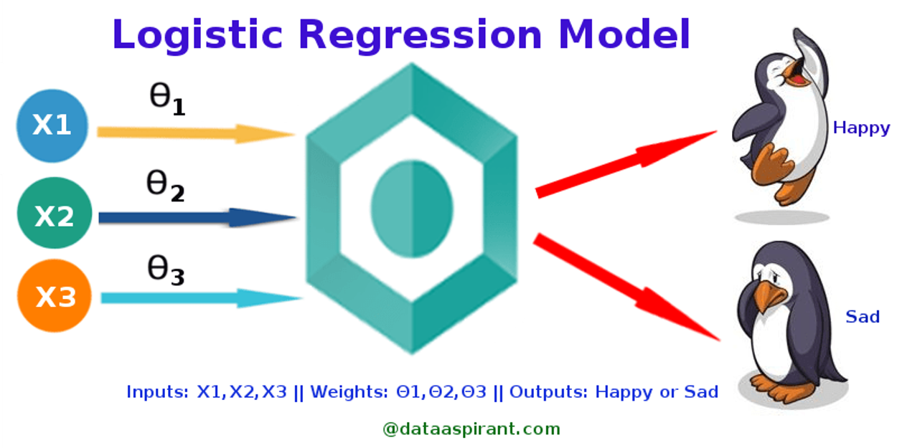
- in a lot of ways, linear regression and logistic regression are similar. But the biggest difference lies in what they are used for. 
- Linear Regression algorithms are used to predict/forecast values but logistic regression is used for classification tasks
- it is a classification not a regression algorithm 
- it is used to estimate discrete values(binary values like 0 or 1 , yes or no , true or false) based on a given set of independent variable(s)
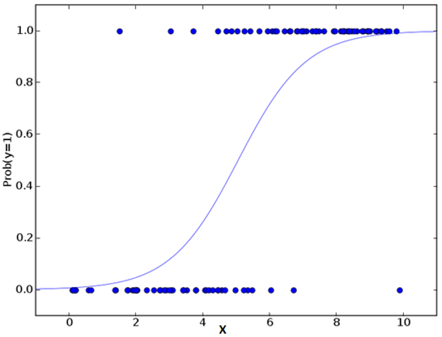
### LIR VS LOR : 
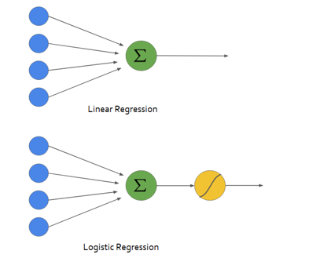

- Logistic regression is used when the dependent variable is categorical. 
- to predict whether an email is spam of no , tumor is malignant or not , whether website is fraudulent or not ... 
- LOR : also uses a linear equation with independent predictors to predicte a value. The predicted value can be anywhere between negative infinity and positive infinity
- we need the output of the algorithm to be class variable : 0 no , 1 yes 
- Therefore, we are squashing the output of the linear equation into a range of 0 and 1. to squash that output we use : THE SIGMOID FUNCTION. 
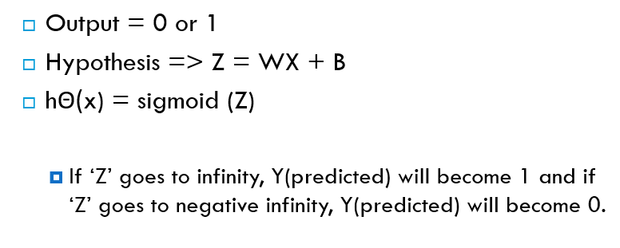
### Sigmoid activation function  : 
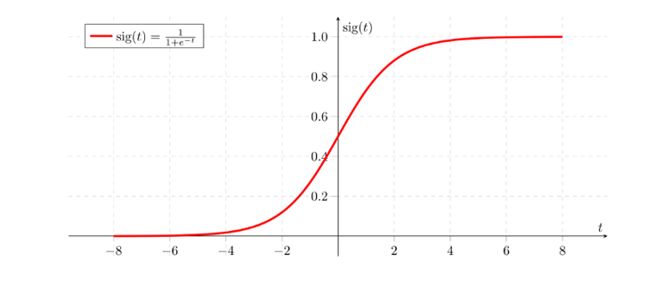
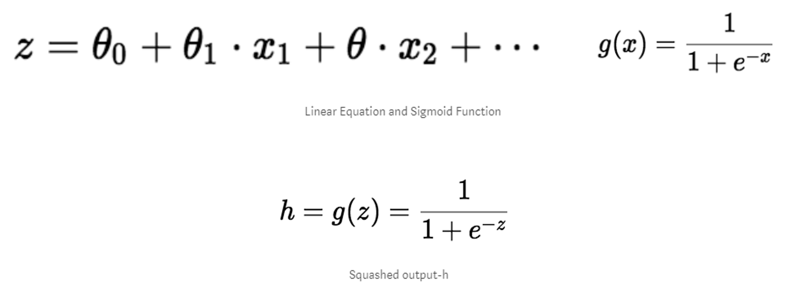
### mathematically this can be written as : [alt text](images/image-36.png)

### type pf logistic regression : 

1. Binary logistic regression : there is only two possible output 
2. Multinomial logistic regression : three or more categories without orderingg 
3. Ordinal logistic regression : three or more categories with ordering: example movie rating from 1 to 5 

### cost function 
- since we want to predict class values , we cannot use the same cost function as in linear regression algorithm. Therefore, we use a logarithmic loss function to calculate the cost fo missclassifying. 

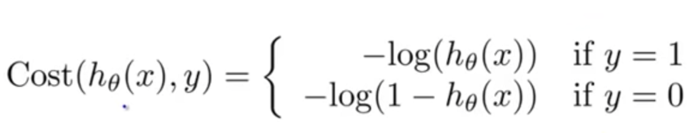
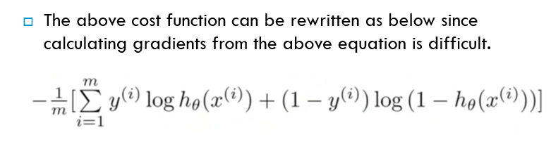

## KNN 

- the principe of this algorithm is very simple : 
- we gave it : training set , distance function d and a number k 
- for each testing point x , we search on D the k nearest points to x using the distance d and we predict that the class of x is the majority class of the k neighbors
- the goal of this algo is to predict the class of unlabled data 
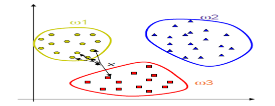
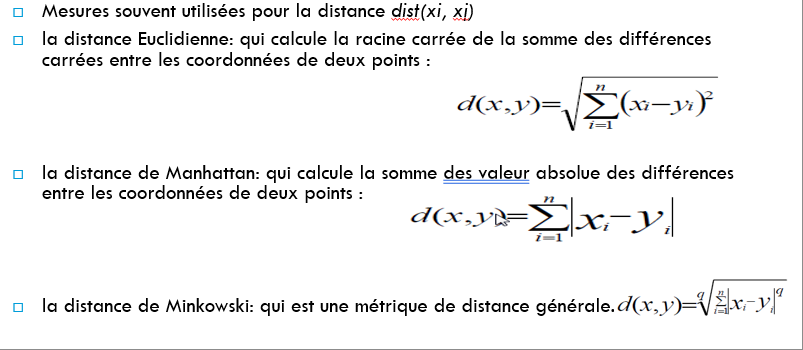

