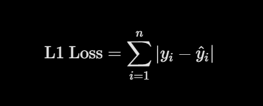
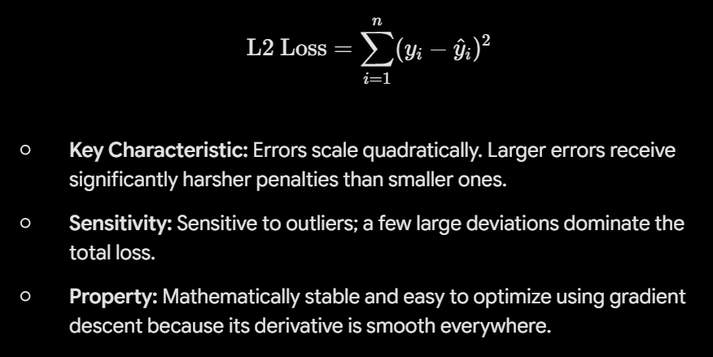
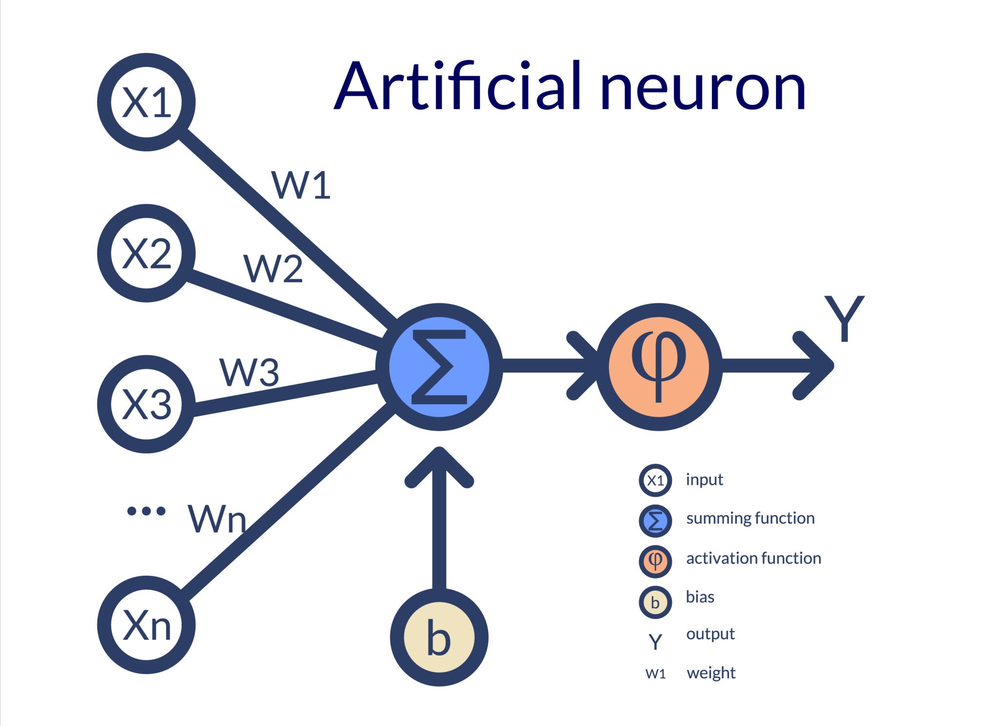
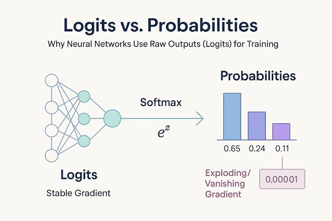
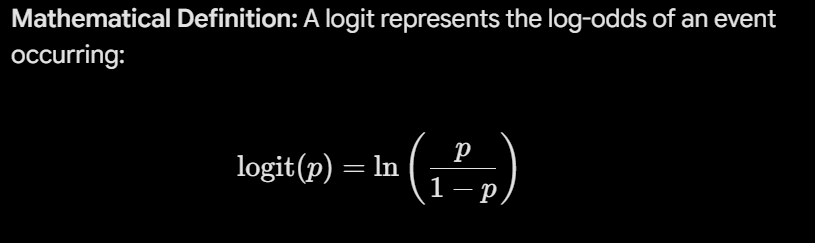
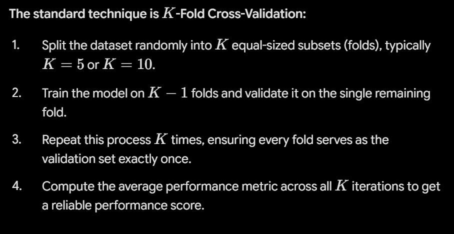
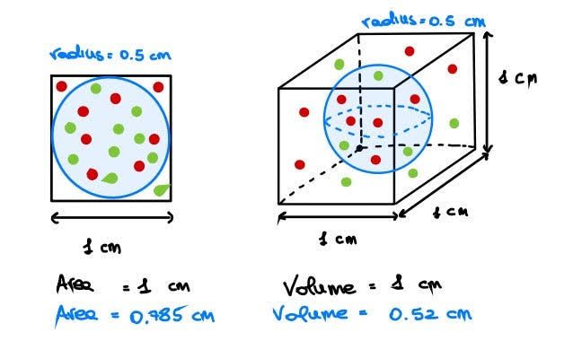
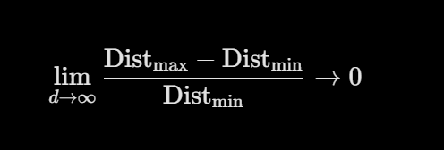

### what is machine leanring ? 
- machine learning is a branch of AI where computers learn patterns from historical data to make predictions or decisions , rather than relying on explicitly programmed rules. Instead of hardcoding logic, we train algorithms on data so they can automatically improve their performance and adapt to new, unseen inputs over time.

- est une branche de l'ia ou les ordinateurs apprennent a partir de donnees historiques pour effectures des predictions ou prendre des decisions, plutot que de suivre des regles explicitement programmees. Au lieu de coder une logique rigide, nous entrainons des algorithmes sur des donnees pour qu'ils ameliorent automaqtiquement leurs performances et s'adaptent a de nouvelles informations au fil du templs. 

### Explain Epoch, Batch, Batch size and iteration ? 
- Batch : a subset of the training dataset passed to the model in a single step to calculate loss and update weights 
- Batch size : the exact number of data samples contained within a single batch (e.g. 32,64,or 128 samples). 
- Iteration: One single gradient update(a step) where the model processes one batch and updates its internal parameters 
- Epoch : One complete pass of the entire training dataset through the model(1 epoch= Total dataset size/ batch size in terms of iterations)
### what are embeddings in machine learning ? 
- Embeddings are dense numerical vector representations of high dimensional data(such as words, images, or graph nodes) mapped into a lower dimensional continuous space- Unlike simple one hot encoding, embeddings capture semantic relationships and context : items with similar meanings or properties are placed close to each other in the vector space, allowing models to calculate semantic distance and similarity efficiently.

### what is Softmax Activation Function ? 
- The softmax activation function converts a vector of raw, unnormalized real valued scores(logits) from a neural network into a probability distribution over multiple mutually exclusive classes.

### what is reinforcement learning ? 
- RL is a machine learning paradigm where an autonomous agent learns to make optimial decisions by interacting with a dynamic environment through trial and error. Unlike supervised learning which relies on labeled datasets, RL guides learning using a feedback system of rewards and penalties : 
- Agent : The decision maker
- Environmentt : everything the agent interacts with 
- State (s) : The current situation or configuration of the environment. 
- Action(a) : a move chosen by the agent from the available options. 
- Reward(r) : Scalar feedback from the environment evaluating the action(positive for desirable outcomes, negative for mistakes)
- the goal : the agent attempts to maximize its total cumulative reward over time by learning an optimal policy policy - a strategy mapping states to the best possible actions(e.g. autonomous driving, game AI like alphaGo or robotic control )

# I MUST READ MORE ABOUT IT 

### what is bias ? 
In ML, bias refers to the difference between the average prediction of a model and the actual ground truth values.  
Depending on the context, "Bias" has three distinct meaning in ML 
1. Bias variance tradeoff(Estimation Error) : High bias occurs when an algorithm makes overly simplistic assumptions about the underlying data patterns. This leads to underfitting, where the model performs poorly on both training and test datasets. 
(e.g fitting a straight line to quadratic data)
2. Model Parameter(Intercept): In linear models and neural networks, bias(b) is an explicit additive scalar parameter in y=wx+b. It allows the activation function or decision boudary to shift up, down, or laterally, independently of the input features 
3. Inductive/Data Bias : Inductive bias : the inherent prior assumptions an algorithm relies on to generalize to unseed data(e.g. CNNs assuming spatial locality) -- Data  Bias : Systematic errors or skewness in training data that cause models to produce unfair or discriminatory outputs. 

### what is the difference between classification and regression ? 
The primary difference between regression and classification lies in the nature of the target variable y the model is trying to predict : 
- Regression : predicts a continuous, numerical quantitative value. Output variables exist on an infinite scale
- Classification : Predicts a discrete, categorical label or class. Output variables belong to predefined groups(e.g. binary : span vs non spam ; multiclass: Cat, dog or bird)
### Explain overfitting and underfitting . how can you prevent it ? 
- Underfitting(High bias): occurs when a model is too simple to capture the underlying patterns in the data.It  performs poorly on both the training set and unseen test data 
- Overfittingg(high variance) : Occurs when a model is overly complex and learns both the underlying patterns and the noise(flukes) of the training data. It achieves high accuracy on training data b ut generalizes poorly to new, unseen test data.
### What are L1 and L2 Loss functions ? 
- L1 Loss(Mean absolute error) and L2 loss(Mean squared error) are loss functions used to measure the difference between a model's predicted values ($\hat{y}_i$) and actual grounf truth values(yi)
1. L1 Loss - Mean absoulte Error(MAE) : calculates the sum of absolute differences between actual and predicted values : 

- Key Characteristic: Errors scale linearly. Small and large errors are penalized equally.

- Robustness: Highly robust to outliers because it does not square large errors.

- Property: Leads to sparse solutions when used as a penalty term (L1 Regularization / Lasso).
2. L2 Loss - Mean squared Error (MSE) : calculates the sum of squared differences between actual and predicted values : 

### what is regularization ? explain L1 Lasso and L2 Ridge regularization 
- Regularization is a technique used in amchine learning to prevent overfitting by adding an explicit penalty term to the loss function. It discourages the model from learning overly complex patterns or assigning unnecessarly large weights t o input features, forcing it to generalize better to unseen data.  
instead of minimizing raw training loss(L) , a regularized model minimizes : 
$$\text{Total Loss} = L(\theta) + \lambda \cdot P(\theta)$$   Where $L(\theta)$ is the primary loss function (e.g., MSE), $P(\theta)$ is the regularization penalty, and $\lambda$ (lambda) is a hyperparameter that controls penalty strength.
1. L1 Regularization (Lasso Regression) : Lasso (Least absolute shrinkage and selection operator) add a penalty proportional to the absolute sum of the magnitude of the feature weights : $$P(\theta) = \sum_{j=1}^{p} \vert{}\theta_j\vert{}$$ 
- Mechanism : Drives less important feature weights striclty to zero 
- Key benefit ---- 

### what are loss functions and cost functions ? Explain the key difference between them 
- both terms measure how far a model's predictions are from actual values, but they differ in scope : 
- - Loss function : Evaluates the error for a single data instance or training sample. It measures individual model performance (e.g., $L(y_i, \hat{y}_i)$)
- - Cost Function : Measures the average loss across the entire dataset(or batch) , often including additional penalty terms such as regularization penalties (e.g $J(\theta) = \frac{1}{n} \sum_{i=1}^n L(y_i, \hat{y}_i) + \text{regularization}$ )
### what are drop outs ? 
is a regularization technique designed specifically for deep neural networks to prevent overfitting.   
During training, dropout randomly deactivates(sets to zero) a chosen percentage p of neurons in a layer for a given forward-backward pass. A different random subset of neurons is dropped at every iteration.How it works: By temporarily shutting down random neurons, it prevents units from co-adapting—meaning individual neurons cannot rely on specific neighboring nodes to fix their errors. This forces the network to learn redundant, robust features.Training vs. Inference:Training Phase: Neurons are randomly dropped with probability $p$ (typically between $0.2$ and $0.5$).Inference/Testing Phase: All neurons are active, but their outputs are scaled down by $(1 - p)$—or scaled up during training using Inverted Dropout—to preserve expected value bounds.Key Effect: Acts like training an ensemble of exponentially many smaller subnetworks, significantly improving generalization.
### what is a perceptron ? 

Perceptron is the simplest fundamental unit of an artificial neural network a single layer binary classifier invented by frank rosenblatt in 1958. It takes multiple real-valued input signals, processes them linearly and passes the result through a step function to output a binary decision 0 or 1 

### Explain multilayer Perception MLP
is a foundational feedforward artificial neural network that overcomes the non-linear limitations of a single perceptron. It consists of an input layer, one or more Hidden Layers, and an Output Layer. 
- Architecture : Fully connected(dense) layers where every neuron in layer L connects to every neuron in Layer L+1 
- Non-linearity : Unlike single perceptrons, MLPs placec non-linear activation functions(ReLU,sigmoid,Tanh .. ) after hidden layers allowing the network to learn complext non linear boundaries(such as solving the XOR problem)
- Learning mechanism : Trained using Backpropagation with Gradient Descent : 
1. Forward Pass : inputs flow forward to calculate predictions and loss. 
2. Backward Pass : Gradients of the loss are computed with respect to weights using the chain rule to update parameters 
### what is cross-entropy ? 
a loss function used primarly in classification models to quantify the difference between two probability distribution : the true labels(y) and the model's predicted probabilities($\hat{y}$)
- it measures the distance between target and predicted probabilities by heavily penelizing cofident, incorrect predictions. 
- much things to be added 
### what are Logits ? 

logits are the raw, unnormilized prediction scores generated by the final linear layer of a classification model (e.g. a neural network) before any normalization or activation function is applied 

### explain cross validation ? why is it used ?
CV is a resampling technique used to evaluate how well a machine learning model generalizes to an independent , unseen dataset. 
 
Instead of relying on a single fixed train-test split , CV splits the data into multiple subsets, systematically trains the model on a portion of the data and validates it on the remaining held-out portion over multiple iterations. 

- why do we use it ? 
- - Prevents overfitting and data leakage : a single train/testt split can yield overly optimistic or pessimistic results depending on how the data was randomly split. CV ensures every data point is tested ... 

### what are precision ? recall and F1-score ? 
are fundamental evaluation metrics for classification models, derived from the confusion matrix components  : 
- True positives : correclty predicted positive instances 
- False positives (FP) : negative instances incorrectly predicted as positive(Type I error)
- False Negatives : positive instances incorrectly predicted as negative(Type II error)
1. Precision : measures the accuracy of positive predictions -- out of all instances the model labeled as positive , how many were actually positive. the goal is to minimize false Positive
### what is anomaly detection ?
also known as outlier detection is a machine learning and statistical technique used to identify rare data points, events or observations that deviate sifnificantly from the expected pattern or standard behavior of a dataset   
### what is the difference between policy-based and value-based methods ? 
In reinforcement learning , the fundamental difference lies in how the agent selects actions : value based methods learn expected rewards to derive action selection implicitly, while policy-based methods learn the optimal action strategy directly 
### what is Q-learning ? 
is a model-freem off-policy reinforcementt learning algorithm used to find the optimal action-selection policy for a Markov decision process MDP
### Explain the concept of exploration vs exploitation ? 
The exploration vs exploitation dilemma is a fundemental is a fundemental tradeoff in decision-making, Reinforcement learning and multi armed bandit problems. It balances gathering new information against maximizing immediate returns based on current knowledge. 
###  explain the curse of dimensionality and how to address it ? 
the curse of Dimensionality refers to various phenoma analyzing and organizing data in high-dimensional spaces(hundreds or thousands of features) that do not occur in low-dimensional settings.

1. whys it happens : 
- Exponential data sparsity : as the number of dimensions d grows, the volume of the feature space expands exponentially($V \propto s^d$). to maintain the same data density, the required number of samples grows exponentially. Without massive data, the space becomes extremely sparse 
- Distance concentration effect : In high dimensions, the Euclidean distance between any two points converfes to approximately the same value :

### explain local loss, focal loss, and gradient blending in the context of multi-task learning ? 
In multitask learning, a single shared achitecture predicts multiple outputt targets simultaneously. However, training joint networks introduces major challenges: task imbalance, varying sample difficutly and conflicting gradient updates between tasks.  
Local loss , focal loss and gradient blending represent three distinct strategies to optimize multi task and multi objective neural network
### Expalin contrastive learning ? 
a self supervised machine learning technique where model learns to distinguich between similar and dissimilar points by comparing them. Instead of learning to classify a specifiv label(e.g this is a dog), the model learn the underlying structure of the data by mathematically grouping similar inputs together and pushing different inputs for apart in a latent space.
### what is Generative AI? 
Generative AI is a branch of artificial intelligence designed to create entirely new content—such as text, images, music, code, or video—rather than just analyzing or categorizing existing data. It works by learning the underlying patterns and structures from massive amounts of training data, then using those patterns to generate original, human-like outputs based on a user's prompt.
## Algorithms : 
### How does a decision tree algorithm work ? 
A decision tree works by breaking down a complex dataset into smaller, more homogeneous subsets through a series of if-else questions. It starts at the top at the root node and evaluates all available features to find the single split that best separates the data. To pick that best split, it measures impurity using metrics like Gini Impurity or Entropy for classification, or variance reduction for regression. The algorithm continues splitting the data recursively at each decision node until it hits a stopping criteria, such as reaching a maximum depth or a minimum number of samples per leaf. The final nodes, called leaf nodes, assign the predicted class or average numerical value to any new data point that follows that path. While decision trees are very intuitive and easy to interpret, they can easily overfit if left unchecked, which is why controlling tree depth or transitioning to ensemble methods like Random Forests is crucial in practice
### Explain how decision trees make splits and handle categorical features ? 
To make a split, a decision tree evaluates every available feature and tests candidate split points to find the one that creates the purest child nodes. For classification tasks, it measures purity using metrics like Gini Impurity or Entropy, choosing the feature and threshold that maximize the drop in impurity, known as Information Gain. For regression tasks, it picks the split point that minimizes the variance or mean squared error within the child nodes.

When it comes to handling categorical features, it largely depends on the library implementation. Standard algorithms, like scikit-learn's implementation of CART, require numerical input, so categorical variables need to be preprocessed beforehand—using One-Hot Encoding for nominal variables or Ordinal Encoding when there is a natural hierarchy. However, some native implementations can handle categories directly by testing different subsets of categories, grouping them into left and right branches to find the exact combination of categories that optimizes node purity.
### How does the random forest algorithm work ? how does it improve over decision trees ? how does it reduce variance ? 
Random forest is an ensemble learning algorithm based on bagging(Boostrap Aggregating) combined with feature subspace sampling, designed primarily to reduce the high variance typical of individual decision trees.
1. How the algorithm works : 
- 1. Bootstrapping : Given a dataset of N samples, we generate B distinct bootstrap samples by randomly sampling N rows with replacement. Each sample contains roughly 63.2% unique data points. 
- 2. Node-Level Feature Sampling : we grow a decision tree on each bootstrap dataset. However, at every sing node split, instead of evaluating all p features, we randomly select a subset of m candidate features(typically $m = \sqrt{p}$ for classification, $m = p / 3$ for regression) and choose the best split strictly from that subset. 
- 3. Full Growth : Each tree is grown deep without pruning to keep individual tree bbias low. 
- 4. Aggregation : To make the final prediction : 
    - classificaiton : we take a majority vote(or average predicted class probabilities)
    - regression : we average the continuous outputs of all B trees. 
2. Improvements over a single decision tree : 

- Lower Generalization Error: Single trees overfit easily by memorizing noise. Averaging unpruned trees cancels out individual errors, yielding far better out-of-sample stability.

- Built-in Out-of-Bag (OOB) Validation: Because each tree leaves out roughly 36.8% of the data during bootstrapping, these OOB samples act as a built-in validation set to estimate model performance without requiring a separate train/test split.

- Robust Feature Importance: Instead of relying on a single tree's splits, Random Forest computes global feature importance (e.g., Mean Decrease in Impurity) by averaging node splits across hundreds of trees.

3. How it reduces variance(the mathematical core) : 

### Explain Ensemble Methods. why are they powerful ?  
Ensemble methods are learning algorithms that combine the predictions of multiple base models(often called "weak learners") to produce a single final prediction that is sifnificantly more accurate and robust than any individual model could achieve on its own 
1. The core intuition : wisdom of the crowd ..

### What is the difference between bagging and boosting ?
while both bagging and boosting are enemble techniques that combine multiple base learners into a single model. they differ fundementally in how trees are trained, how predictions are combined and which component of error they target. 
 a table to be read
### what is gradient Boosting ? How does XGBoost work ? 
gradient boosting is an ensemble algorithm that builds a predictive model iteratively by combining multiple weak learners - typically shallow decision trees.  
Instead of building trees independetly in parallel(like random forest) , gradient boosting builds trees sequentially : each new tree is trained to predict the negative gradients(residuals) of the loss function calculated from all previous trees combined. 
### what are the key hyperparameters for XGBoost ? 
### Explain Gradient Boosting and its advantanges over Random Forests ? 
### Explain how logistic regression differs from linear regression ? 
### How does logistic regression work ? 
### Explain R-squared and adjusted R-squared ? 
### how do you check multicollinearity in regression models ? 

### how KNN works ? 
### Explain Kmeans clustering, how does it work ? limitations ? 
### explain SVM , what is the kernet trick ?  
### what is the decision boundary in classifiers ? 
### explain Naive Bayes 
### what is dimensionality reduction ? 
### Explain PCA(Principal component Analysis). How does it work ? when would you see it ?
### explain gradient descent and its variants ? 

### what is the ROC-AUC curve and how is it interpreted ? 

## Data preprocessing and feature engineering : 
### what is feature engineering ? 
### what is one hot encoding ? 
### how do you deal with missing data? 
### How do you handle Outliers ? 
### Explain feature scaling. why is it needed ? 
### One hot , label , target and k-fold encoding ? 
### how do you handle categorical features ? 
### Expalin feature selection vs feature extraction ? 
### How would you create new features from existing ones ? 
### how do you approach a dataset with highly imbalanced classes ? 
### How do you select features for a model ? 
### Why and how do you split data into a train, test and validation set ? 

## OPTIMIZATION :
--- 

### what is gradient descent ? how does it work ? 
In machine learning gradientt descent is an iterative optimization algorithm used to minimize a loss function $L(\theta)$ by updating model parameters $\theta$ (weights and biases) in the direction of the steepest descent of the loss landscape. 
1. The analogy & Core Intuition : Imagine you are standing at the top of a foggy mountain at night and wantt to reach the lowest valley : 
    1. Sense the slope : You feel the ground beneath your feet to determine which direction slopes downward most steeply(the gradient)
    2. Take a tep : You take a tep of a specific size(the learning rare n) in taht downhill direction 
    3. Iteerate: You repeat this process step-by-step until the gorund flattens out(the gradient reaches zero), indicating you've reached minimum.
2. The mathematical Algorithm : 

### what is stochastic gradient descent ? 

stochastic gradient descent is a variant of gradient descent optimizationa algorithm where , instead of calculating the exact gradient descent of the loss function using the entire dataset, we update the model parameters using a single randomly selected training sample at each step

### what are vanishing gradients ? 
the vanishing gradient problem occurs during the training of deep neural networks using backpropagation, where the gradients of the loss function with respect to the weights in the early(bottom) layers become exponentially small(approaching  zeor)
### what is a learning rate ? how to choose a good one ? 
in ML, the learningg rate(denoted as $\eta$ or $\alpha$) is a fundemental hyperparameter that controls the step size taken during parameter updates as an optimization algorithm like gradient descent moves toward minimizing a cost function. 

### how does the learning rate affect model training ? 
the learning rate directly determines how fast m how stably and how effectively a model's weights adapt during training. It dictates both the trajectory of the loss curve and the final quality of the learned weights
### how do you approach hyperparameter tuning ? 
Appraoching hyperparameter tuning systematically requires balancing seach space exploration, computational cost and evaluative rifor to prevent data leakage and overfitting. 
1, establish the validation strategy first 
### What is model quantization and when would you use it ? 
model quantization is an optimization technique that reduces the memory footprint and computational cost of deep learningg models by converting their weights and activations from high-precision floating-point
### How do you ensure fairness and reduce bias in ML models ? 

### Explain grid search vs Random search vs Bayesian Optimization ? 

### Explain TPE hyperparameter optimization ? 

### Explain Bayesian optimization ? 

### Explain adam optimizer ? 

### explain the RMSprop Optimizer ? 
### what is adagrad optimizer ? 

# Deep learning : 

### what are neural networks ? 
is a machine learning model inspired by the structure of the human brain. At its core, it's designed to recognize complexe patterns, learn non-linear relationships and extract features from high-dimensional or unstructured data- like text , images or audio without needing hand crafted features. 
- it consists of 3 main structural layers : 
1. input layer : receives the raw features(such as numerical metrics or flattened image pixels)
2. Hidden layer(s): One or more layers where feature extraction and non linear transformations occur. 
3. Output layer : Produces the final prediction , such as a continuous value in regression or class probabilities in classification. 
### Explain the feedforward neural network ? 
- FNN often referred to as a Multi-layer perceptron MLP -- is the mostt foundational architecture in deep learning. It is called "feedforward" because information moves in one single direction : from the input nodes through any hidden layers directly to the output nodes. there are no loops, cycles or feedback connections within the network architecture
### what are forward propagation and backward propagation ? 
in a neural network, forward and backward propagation are the two fundamental phases that complete a single training step.Together, they allow the network to make a prediction, evaluate its error and update its parameters to improve future predictions.
### what is backpropagation ? 
Backpropagation is the core training algorithm used to optimize artificial neural networks.It calculates the exact gradient of the loss function with respect to every weight and bias in the network, allowing an optimizer(lile SGD or adam) to update those parameters and reduce prediction error.
### can you name and explain a few hyperparameters used for training a neural network ? 
- are the configuration settings set before training a neural network that control the learningg procecss and model architecture. Unlike weights and biases, hyperparameters are not learned from the data duringg training.
- mention 6 hyperparameters.
### what is the advantage of deep learning over traditional machine learning ? 
- The single most critical advantange of Deep Learning over traditional machine learning is automated feature learning(or feature extraction). 
- In traditional ML models (like logistic regression,random forest or SVMs), human domain expertise is required to manually extract, transform and select relevant features from raw data before passing them to the algorithm. Deep learning models by constrastt automatically discover representations and hierarchical features directly from raw data during training.
### what are activation functions and why they are used ? 
activation functions are mathematical equations applied to the output of each artificial neuron in a neural network. they determine whether and to what degree a neuron should fire or pass its signal to the next layer. 
### Explain Sigmoid,tanH, ReLU, LeakyReLU, and softmax activation functions with their pros and cons? 
### why are Sigmoid and Tanh nor preferred in the hidden layers of a neural network ? 
### what is dropout, and why is it effective ? 

- is a powerful regularization technique used in neural networks to prevent overfitting. 
- during each iteration of training, dropout randomly "drops out" (deactivates) a specific fraction p (typically 0.2 to 0.5) of neurones in a given layer along with their incoming and outgoing connections. 

### What is the effect of dropout on training and inference speed ? 
### what is L1/L2 regularizaiton, and how does it affect a neural network ? 
### what is batch normalization, and why is it used for ? 
### what  are the hyperparameters for batch normalization that can be optimized ? 
### what is parameter sharing in deep learning ? 
### what is representation learning, and why is it useful ? 
### what is a generative model, and how does it differ from a discriminative model ? 
### can you explain how a generative model works ? 
### explain Encoder-Decoder Architecture ? 
### What is the difference between encoder-only,decoder-only, and encoder-decoder Transformer architectures ? 
### What is Latent space ? 
### what  are autoencoders ? Explain their layers and practical uses. 
### What is a Variational Autoencoder(VAE) ,and how is it different from a traditional autoencoder? 
### How does VAE impose a probabilistic structure on the latent space, and why is that important? 
### what is the architecture of a Generative Adversarial Network (GAN) ? 
### what are the roles of the generator and discriminator in a GAN ? 
### what is mode collapse in GANs and how can it be mitigated? 
### How are GANs used in image synthesis or image-to-image translation tasks ? 
### Explain convolutional neural networks (CNN)? 
### Explain filters in CNN? 
### Explain the stride in CNN? 
### Explain padding in CNN? 
### Explain pooling in CNN? 
### explain fully conntected layers in CNN? 
### what is Recurrent neural networks RNN? 
### what are the limitations of RNNs, and how are they solved ? 
### What are LSTM and GRU? how do they solve long-term dependency issues ? 
### what are the main gates in LSTM and their roles ? 
### how to identify exploding gradient issues in your model ?  
### what is a transformer architecture and what makes it differentt fron CNNs and RNNs ? 
### what is the attention mechanism in deep learning , ans why is it significant ?
### what is the basic difference between LSTM and Transformers ? 
### Diffusion models ? 
### why does diffusion work better than auto-regression ? 
### explain transfer learning and when to use it ? 
### what are Multimodal AI models, and how do they process differnt types of data? 
### how do world models work ? 
###  how do diffusion language models (DLMs) work ? 
### Decoding deep RL from human preferences ?

# NLP 
### what are the advantages of transformers over traditional sequence-to-sequence models ? 
### what are the limitations of transformers, and how can they be addressed ?
### whatt is BERT, and how does it improve language understanding ? 
### how are transformers trained (pre-trained and fine tuning) ? 
### explain transfer learning in the context of Transformers ? 
### describe the process of text generation using transformer based language models ? 
### what are Seq2Seq models ? 
### Compare N-gram models and deep learning models(trade-offs) ? 
### what are n-gram model? 
### what is TF-IDF and how does it differ from word embeddings ? 
### what is bag-of-words ? 
### what is perplexity used in NLO ? 
### what is stemming vs lemmatization ? 
### what is Latent semantic indexing ? 
### whatt is dependency parsing ? 
### what are some approaches for text summarization ? 
### what are word embeddings? 
### what is word2vec? 
### what is t-SNE and how is it used for NLP ? 
### Explain colBERT? 