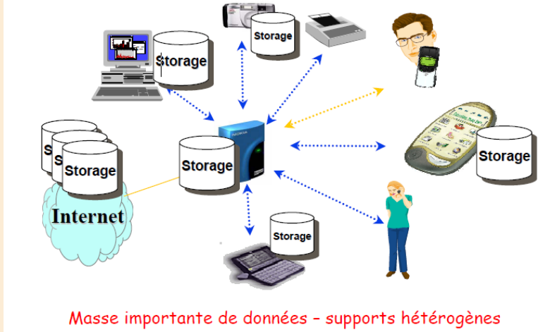
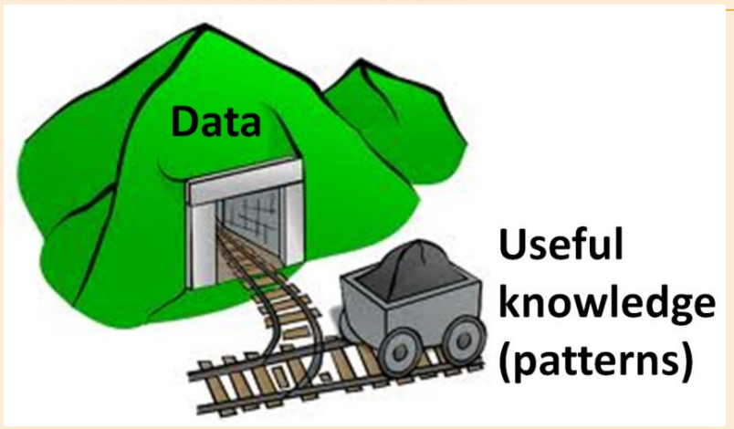
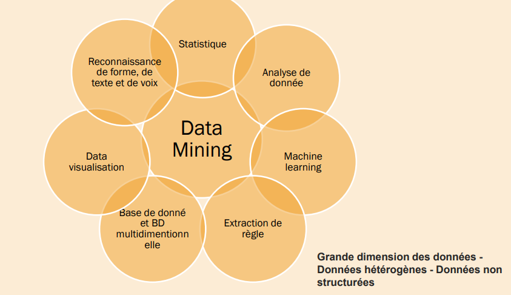
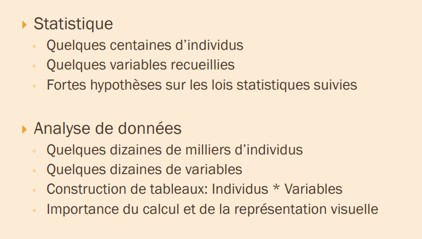
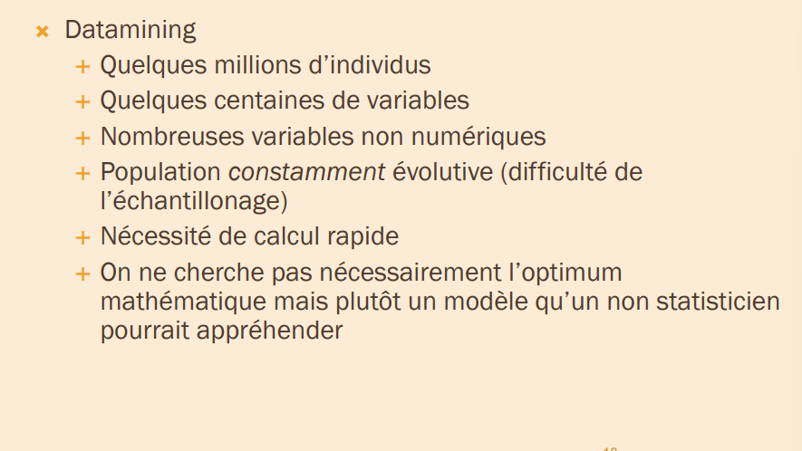
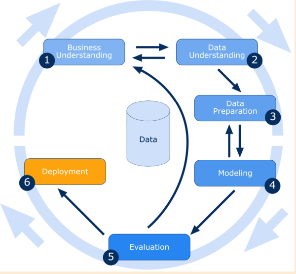
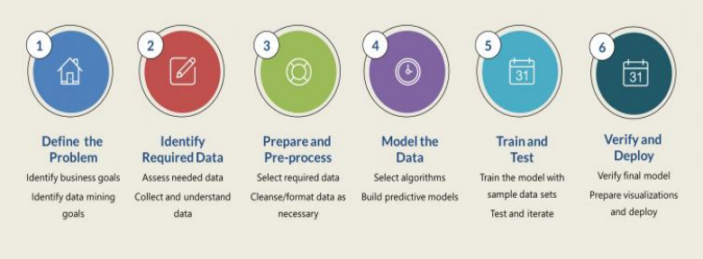
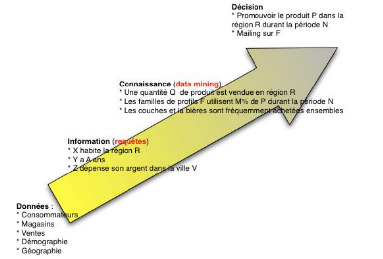
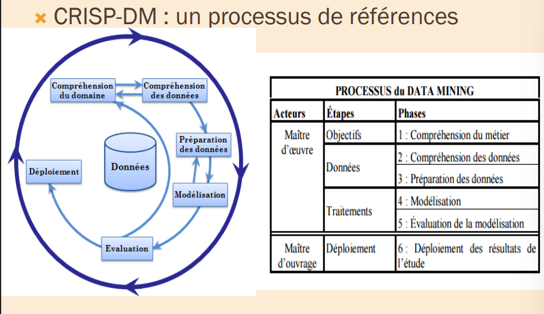

# Data mining : 

 

### definition : 
- data mining : terme recent(1995) representant un melange d'idees et d'outils provenant de la statistique, science de l'information et l'informatique. 
- extraction d'informations interessantes : - non triviales , implicites , prealablement inconnues et potentiellement utiles a partir de donnees. 

- Autres appellations : ECD (Extraction de connaissances a partir de donnees) , KDD(Knowledge Discovery from dataset)
- definition 2 : un processus de decouverte de regle, relations, correlations, et/ou dependancecs a travers une grandre quantite de donnees, grace a des methodes statistiques , mathematiques, d'apprentissage automatique et reconnaissances de formes. 
- rencontre de plusieurs disciplines : 
### KDD : 
- data mining et un terme utilise par les statisticiens 
- KDD par les chercheurs en intelligence artificielle. 

### data mining vs informatique decisionnelle(Business intelligence) : 
- l'informatique decisionnelle(BI) designe les moyens, les outils et les methodes qui permettent de collecter, consolider modelise et restituer les donnees d'une entreprise en vue d0offrir une aide a la decision et de permettre aux responsables de la strategie d'une entreprise d'avoir une vue d'ensemble de l'activite traitee.
- data mining introduit une dimmension supplementaire qui est la modelisation exploratoire(detection des liens de cause a effet, validation de leur reproductibilite)
### data mining vs big data : 
- Big data represente un grand ensemble de donnees qui depassent le type simple d'architectures de gestion de donnees. 
- data miningg se refere a l'activite consistant a parcourir de grands ensembles de donnees pour rechercher des informations pertinentes. 
## DM vs Machine learning : 
- ML concerne l'etude, la conception et le developpement d'algorithmes qui permettent aux ordinateurs d'apprendre sans etre explicitement programmes.
- Le data mining peut être définie comme le processus qui, à partir de
données apparemment non structurées, tente d'extraire des connaissances
et / ou des modèles intéressants inconnus. Au cours de ce processus, des
algorithmes d'apprentissage automatique sont utilisés
### des statistiques : 

### Notes :
- NOT :  
- data mining n'est pas la generation de cubes multidimensionnels a partir d'une BD relationnelle. 
- DM est different de : chercher un num de tel dans une grande BD ou de trouver des mots cles a partir de google
- Generer un histogramme des salaire pour differents groupes d'age. 
- envoyers une requete SQL dans une base de donnees et lire la reponse 
- IT IS : 
- trouver des groupes des personnes ayant des preferences similaires. 
- les chances de cancer sont-elles plus elevees si vous habitez pres d'une ligne electrique? 
### today data mining : 
- les techniques de data mining ne sent pas toutes recentes. 
- ce qui est nouveau : grandes capacites de stockage et de traitement, ce qui permet de faire sortir le DM des labos de recherche pour entrer dans les entreprises. 
- utilise dans les secteurs qui par leur activite, detiennet des tres grandes quantites de donnees : 
    - banques , assurances , telephonies, grande distribution ... 

## Processus general : 

### etaped de L'ECD : CRISP-DM : 
---
- Cross-Industry Standard Process For Data Mining 
- concu en 1996 par Daimler, SPSS et NCR. 
- concu pour etre independant des outils et du domaine d'application.
- doit sa reussite au fait qu'il se base sur des experiences reelles de Data Mining. 

### Difficultes techniques du data mining : 
- 1ere difficulte : comprendre les donnees : du bonne sens!  
Le data mining travaille sur des tableaux de donnees. La premiere difficulte est de comprendre ces tableaux. Tant que les donnees ne sont pas comprises, on ne peut rien faire! 
- 2eme difficulte : Les statistiques,l'analyse de donnees : 
  
Le DM utilise les notions statistiques avec leurs difficultes propres. Toutefois, cette difficulte se resout partiellement si la premiere difficulte est correctement resolue. 

- 3eme difficulte : algorithme  
Il faut comprendre un minimum des algorithmes specifiques du DM pour comprendre les principes, les usage et les limites du data mining. 

- 4eme difficulte : utilisation d'un logiciel 
 
En plus de connaitre les principes generaux du data mining, il faut apprendre a se servir d'un logiciel particulier. 

### Etape du processus de ECD : 
1. Connaitre le domaine d'application (connaissance du buts de l'application)
2. selection des donnees cibles(Analyse Exploratoire des donnees)
3. Pretraitement des donnees : 1. Data cleaning , 2. preprocessing , 3. reduction et transformation de donnees en plus du choix des algorithmes de fouille. 
4. Data mining(recherche des modeles interessants)
5. Evaluation des patterns et presentation de la connaissance : visualisation, transformation etc . 
6. Utilisation de la connaissance. 

## data warehousing processus : 
---
- Datawarehouse(entrepot de donnees) : base de donnees construite dans un but decisionnel depuis des bases de production souvent multi-sources et archivant des donnees historisees et actualisees 
- datamart(magasin de donnees): entrepot de donnees cible sur quelques sujets particuliers a l'echelle d'un departement de l'entreprise 
- Proessus : 
1. regroupement, consolidation ... des donnees d'une entreprise . 
2. ETL(pretraitement des donnees)
3. OLAP : exploration d'un datawarehouse par analyse multi-dimensionnelle et interactive + representation des donnees dans des "data cubes" donnant des totaux, ... , pour chaque variable et pout toute combinaison de variable avec differents niveaux de detail(ex:total annuel, sous-totaux mensuels, par semaine ...)

### les taches du "data mining" :
- contrairement aux idees recues, le data mining n'est pas le remede miracle capable de resoudre toutes les difficultes ou besoins de l'entreprise. 
- cependant, une multitude de problemes d'ordre intellectuel,economique ou commercial peuvent etre regroupes, dans leur formalisation dans l'une des taches suivantes : 
- la description 
- la classification 
- l'estimation 
- les regles d'association(decouverte de motifs sequentiels)
- la segmentation (clustering) 
- la prevision 

### 1. la description :
- Parfois le but c'est de decrire se qui se passe sur une base de donnees compliquees en expliquant les relations existantes dans les donnees pour dans un premier lieu comprendre le mieux possible les individus, les produit et les processus presents dans cette base . 
- une bonne description d'un comportement implique souvent une bonne explication de celui-ci
- c'est souvent l'une des premieres taches demandees a un outil de data mining 
- statistique descriptif - ACP, analyse factorielle. 

### 2. la classification 
- la classification consiste a examiner des caracteristiques d'un element nouvellement presente afin de l'affecter á une classe d'un ensemble predifini 
- dans le cadre informatique,les elements sont representes par un enregistrement et le resultat de la classification viendra alimenter un champ supplementaire par exemple : homme/femme, oui/non, rouge/vert/blue ... 

### 3. l'estimation 
- L'estimation est similaire a la classificaiton a part que la variable de sourtie est numerique plutot que categorique 
- le resultat d0une estimation permet de proceder aux classifications grace a un bareme 
- cette technique sera souvent utilisee en marketing, combinee a d'autres, pour proposes des offres aux meilleurs clients potentiels
- la technqie la plus appropriee a l'estimation est  : les reseaux de neurones

### 4. les regles d'association : 
correlation(ou relations) entre attributs : 
- applications : grande distribution , gestion des stocks, web(pages visitees) , etc 
- exemple : 
    - BD commercialee : panier de la menagere 
    - articles figurant dans le meme ticket de caisse 
    - ex : achat de riz + vin blanc -> achat de possion 

- liaisons entre evenements sur une periode de temps : 
- extension des regles d'association : prise en compte du temps(serie temporelle) - achat television -> achat magnetoscope d'ici 5 ans 

- applications : marketing direct (anticipation des commandes) , bioinformatique(sequence d adn), bourse(prediction des valeurs des actions)

### 5. analyse des clusters : 
- partitionnement logique de la base de donnees en clusters(technique: clustering)
- clusters : se sont des groupes d'instances ayant les memes caracteristiques 
- applications : economie(segmentation de marches), medecine(localisation de tumeurs dans le cerveau), etc . 
### 6. la prevision 
- la prevision est similaire a l'estimation mise a part que pour la prevision, les resultats portent sur le futur 
- exemples : - prevoir le temps qu'il va faire - prevoir le gagnat du championnat de football par rapport a une comparaison des resultats des equipes 

## Data 
### terminologie : 
- une donnee est un enregistrement au sens des bases de donnees. 
- On la nomme aussi individu (terminologie issue des statistiques)
- instance(terminologie orientee objet en informatique)
- tuple (terminologie base de donnees)
- point ou vecteur parceque finalement, d'un point de vue abstrait, une donnee est un point dans un espace euclidien ou un vecteur dans un espace vectoriel 
- une donnee est caracteriste par un ensemble de champs de caracter ou encore d attributs.