# Feature engineering -- data mining 

## Part 
- Feature crosses 
- Feature scaling 
- feature selection 
- feature extraction 
- the last two re - dimensionality reduction 

## feature engineering 

- L'art de representer les donnees dans le meilleur moyen possible 
- Une bonne ingenierie de donnees -> une melange elegant de connaissances de domaine, d'intuition ett de capacites mathematiques de base. 
- Essentiellement, la maniere dontt vous presentez vos donnees a votre algorithme doit indiquer la pertinents, la structures et les proprietes des informations sous jacentes de la maniere la plus efficace possible.
- ingenierie de caracteristiques : attributs de donnees -> fonctionnalites de donnees. 

## reduction de la dimensionalite : 

- quels sont les problemes fondamentaux qui doivent etre resolus dans les reductions de dimentionalite ?
- reduire la dimension des donnees : feature selection 
- comment supprimer les exemples redondants et/ou a conflits ? 
- election d'instance (selection de prototype vs selection d'ensemble d entrainement)

- comment simplifier le domaine d'un attribut ? 
    - discretisation
    - diviser l'intervalle numerique(continu ou non) en intervalles
    - memoriser les etiquettes des intervalles
    - il est crucial pour les regles d'association et certains algos de classification, qui n'acceptent que des donnees discretes. 
- comment combler les lacunes dans les donnees ? 
    - extraction de caracteristiques 

## FEATURE SELECTION 

- les attributs sont essentiellement toutes les dimensions presentes dans les donnees. Mais tous, au format brut, representent-ils les connaissances sous jacentes que nous souhaitons apprendre de la meilleurs facon possible ? 
- La selection : autre element cle du processus d'apprentissage automatique. De ce fait, Il est important de considerer la selection des fonctionnalites dans le processus de selection du modele. Si vous ne le faites pas , vous pouvez introduire par inattention un biais dans vos modeles, ce qui peut entrainer un surapprentissage. 
- probleme consiste a trouver sous ensemble des variables qui optimise la probabilite du classement correct.
- Pourquoi la selection des variables est elle necessaire ? 
    - plus d attributs, moin de succes dans le classement 
    - travailler avec moins de variable minimise la complexite du probleme et diminuer le temps d execution 
    - avec moins de variables la possibilite de generaliser augmente. 

- feature selection est differente de la feature extraction ou reduction de dimension. Les deux methodes cherchent a reduire le nombre d'attributs dans le jeu de donnees, mais une methode d'Extraction de caracteristique ou de Reduction de dimension consiste a creer de nouvelles combinaisons d attributs alors que les methodes de selection incluant et excluant des attributs presents dans les donnees sans les modifier  
-  La sélection des attributs est elle-même utile, mais elle agit
principalement comme un filtre, en désactivant les attributs qui
ne sont pas utiles. Les méthodes de sélection des
caractéristiques peuvent être utilisées pour identifier et
supprimer les attributs inutiles, non pertinents et redondants
des données qui ne contribuent pas à la précision d'un modèle
prédictif ou qui peuvent en fait diminuer la précision du
modèle 
- elles permet de : 
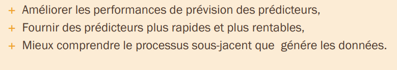

- dans un algorithme de selection de caracteristiques, distinguer deux composantes principales : 
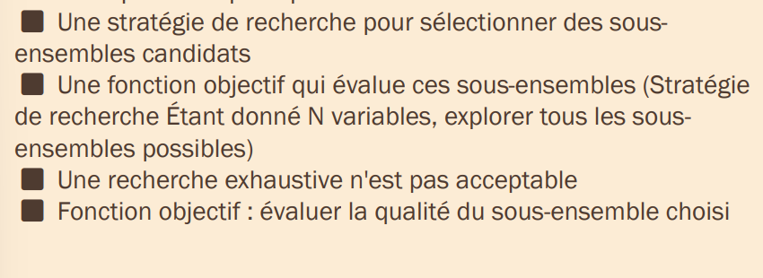
- 3 classes generales d'algorithmes de selection de caracteristiques : methodes par filtrage , methodes dite wrapper , methodes integrees (embadded)

## methodes par filtrage : 

- les methodes de filtrage appartiennent a la categorie des methodes de selection d'entites qui selectionnent des entites independamment du modele d'algorithme d'apprentissage automatique.
- C'est l'un des plus grands avantages des methodes de filtrage 
- les fonctionnalites selectionnees a l aide de methodes de filtrage peuvent etre utilisees comme entree dans tous les modeles d'apprentissage automatique 
- un autre avantage des methodes de filtrage est qu'elles sont tres rapides 

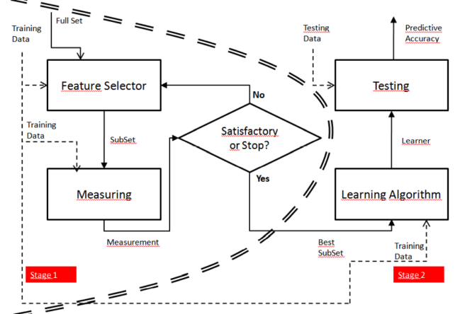

### methode par filtrage -- Uni-variee 
- les caracteristiques sont classees individuelles selon des criteres specifiques
- les N principales caracteristiques sont ensuite selectionnees 
### ANOVA 
- anova effectue pour chaque entite une analyse de la variance ou la variable de classe est expliquee par l'entite. La valeur startique F est utilisee comme score 
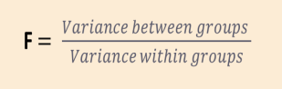
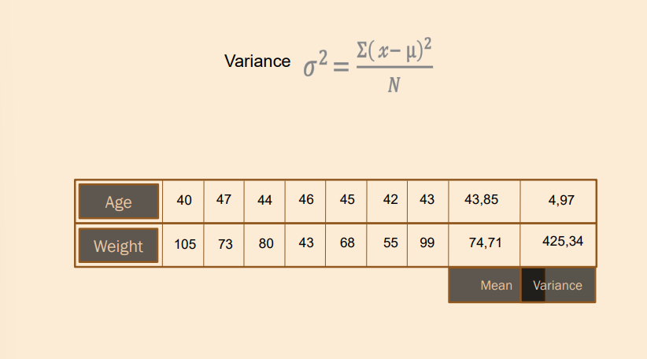
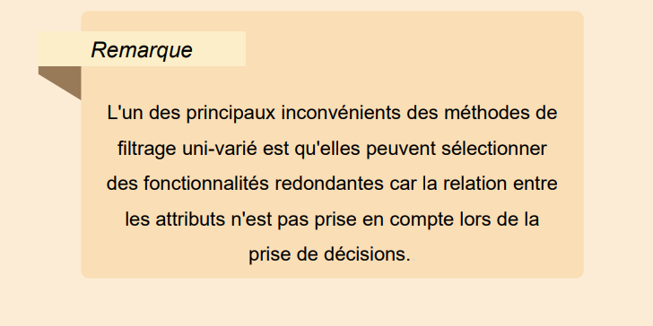
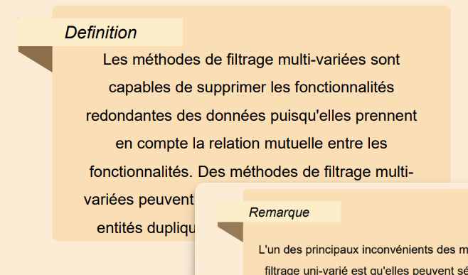
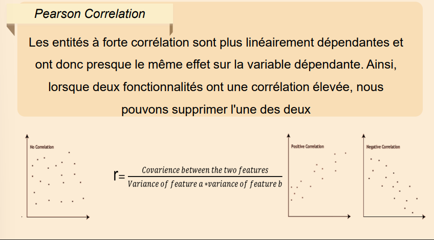
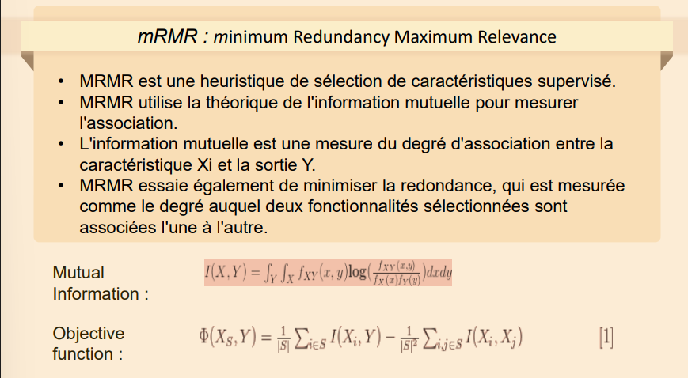

## Feature selection : Wrappers 
---
- dans certains scenarios, vous pouvez utiliser un algortihme d'apprentissage automatique specifique pour former votre modele. Dans de tels cas, les caracteristiques selectionnees a l aide de methodes de filtrage peuvent ne pas constituer l'ensemble de caracteristiques optimal pour cet algorithme specifique 
- Il existe une autre categorie de methodes de selection des fonctionnalites qui selectionne les fonctionnalites les plus optimales pour l'algorithme specifie. De telles methodes sont appeles methodes wrapper 
- les methodes wrapper considerent la selection d un ensenble de car. comme un probleme de recherche, dans lequel differentes combinaisons sont preparees, evaluees et comparees a d autres combinaisons 

- les methodes d'encapsulation sont basees sur des algorithmes de recherche(greedy seach), car elles evaluent toutes les combinaisons possibles d'attributs et selectionnentt la combinaison qui produit le meilleur resultat pout algo de ML specifique 
- un inconvenient de cette approche est que le test de toutes les combinaisons possibles des fonctionnalites peut s'averer tres couteux en calcul, en particulier si le nombre d attribut est tres grand 

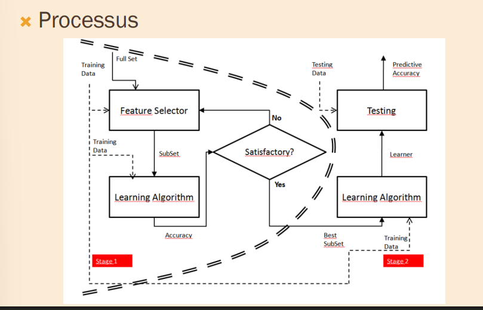

- les methodes d encapsulation pour la selection des fonctionnalites peuvent etre divisees en 3 categories : selection de fonctyionnalites en avant , en arriere , exhaustive 
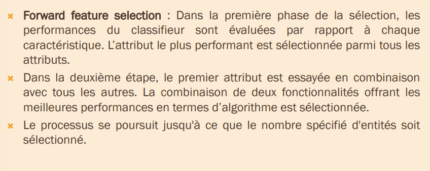
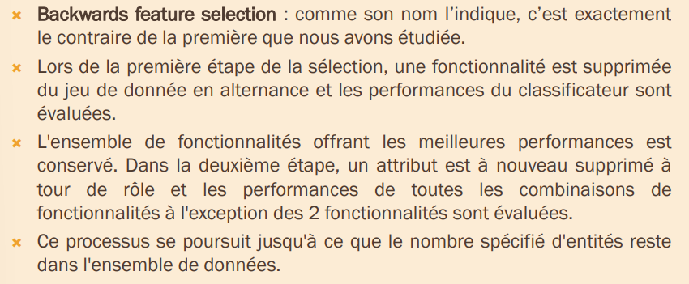
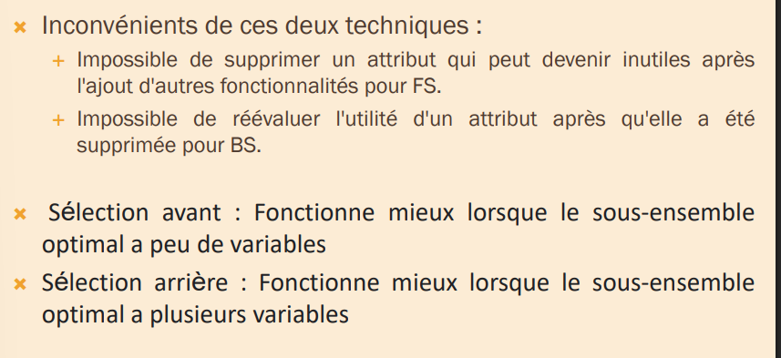
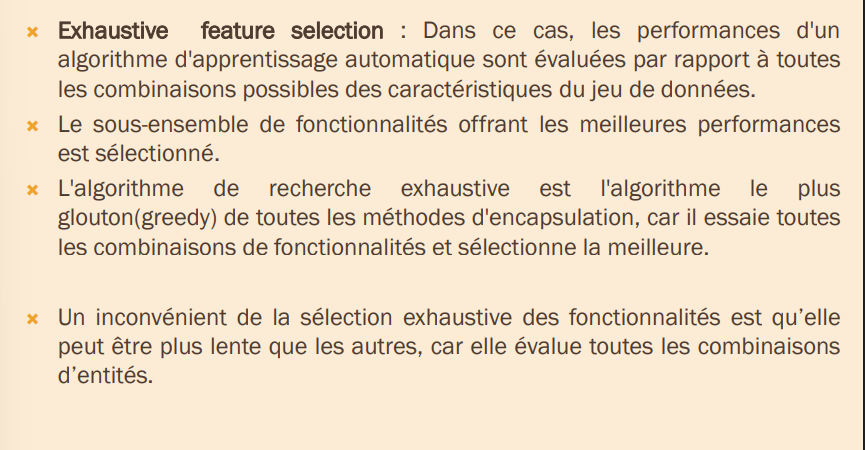

### LRS : Plus L MINUS r SELECTION :
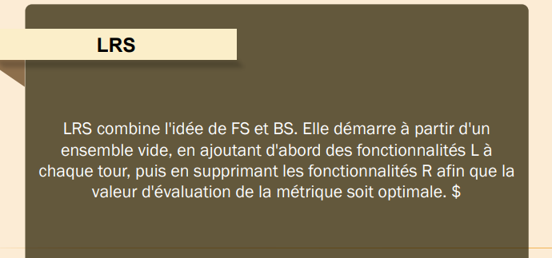
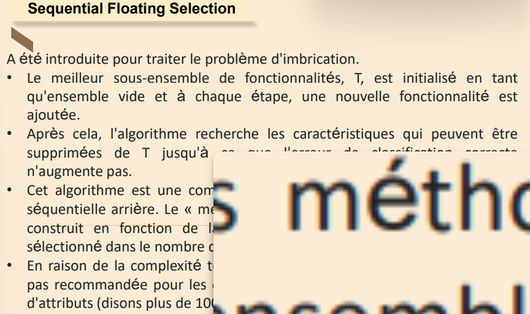

## les methodes integrees : feature selection 

## feature extraction : 

- est un processu de reduction de dimensionalite par lequel un ensemble initial de donnees brutes est reduit a des groupes plus faciles a gerer et a analyser 
- une caracteristique de ces grands ensembles de donnees est un grand nombre de variables qui necessitent de nombreuses ressources informatiques pour etre traiter 
- feature extraction est le nom de methodes qui combinent des variables en fonctionnalites(features), ce qui reduit efficacement la quantite de donnees a traiter, tout en decrivant de maniere precise et complete le jeu de donnees d'origine
- il fait reference au processus de conversion d un ensemble de donnees ayant de vastes dimesions en donnees de dimension inferieures garantissant ainsi la transmission concise d informations similaires 

- le processus d extraction de foncionnalites est utile lorsque vous devez reduire le nombre de ressources necessaires au traitement sans  perdre les informations importantes ou pertinentes 
- l'extraction de fonctionnalites peut egalement reduire la quantite de donnees redondantes pour une analyse donnee 
-En outre, la réduction des données et les efforts de la machine pour créer
des combinaisons de variables (fonctionnalités) qui facilitent les étapes
d’apprentissage et de généralisation lors du processus d’apprentissage
automatique.
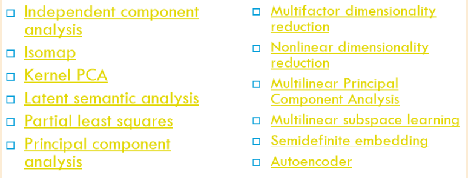

## feature scaling :
- la mise a l'echelle des fonctionnalites est une methode utilisee pour normaliser la plage de variables independantes ou de fonctionnalites de donnees. Dans le traitement des donnees on parle egalement de normalisation des donnees et est generalement effectue au cours du processus de pretraitement 

- la normalisation signifie generalement que les valeurs sont redimensionnees dans une plage de [0,1]
- la standardisation signifie generalement que les donnees  sont remise à
l’echelle de façon à avoir une moyenne de 0 et un écart type de 1 (variance
d'unité). La plage de valeurs est "normalisée" pour mesurer le nombre
d'écarts-types entre la valeur et la 

