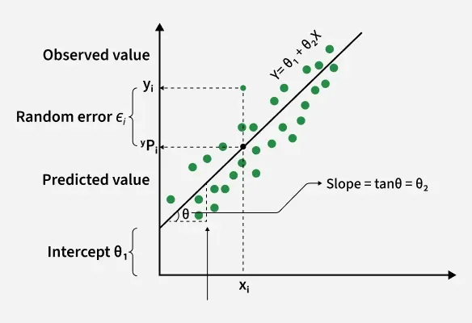
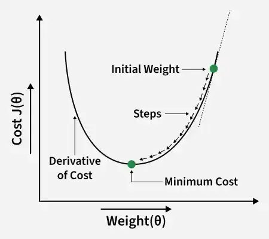
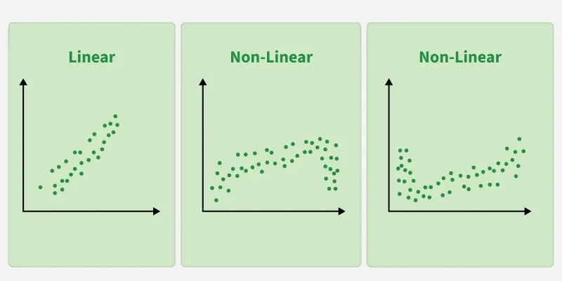
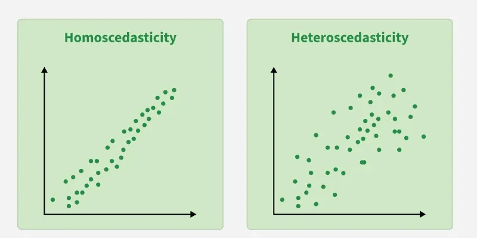

# Linear Regression 

### what is linear regression : 
- LR is a fundamental supervised machine learning algorithm used to model the relationship between a dependent variable and one or more independent variables. It predicts continuous values by fitting a straight line hat best represents the data. 

- it assumes that there is a linear relationship between the input and output 
- Uses a best-fit line to make predictions. 
- Commonly used in forecasting, trend analysis and predictive modeling. 
 
For example, suppose we want to predict a student's exam score based on the number of hours studied. As study hours increase, exam scores generally increase as well 

## Best fit line : 
in linear regression, the best fit line is the straight line that best represents the relationships between the independent and dependent variable. the goal is to minimize the difference between the actual data points and the predicted values generated by the model. 

### 1. goal of the best fit line : 
the goal of linear regression is to find a straight line that minimizes the error(the difference) between the observed data points and the predicted values. this line helps us predict the dependent variable for new, unseen data. 

Here Y is called a dependent or target variable and X is called independent variable also known as the predictor of Y 
- theta 1 represents the intercept, which is the value of Y when X=0
- theta 2 represents the slope, which shows how much Y changes for a unit change in X

 
There are many types of functions or modules that can be used for regression. A linear function is the simplest type of function. Here, X may be a single feature or multiple features representingg the problem 

### 2. Equation that best fit line 
For simple linear regression(with one independent variable), the best-fit line is represented by the equation : y= mx+b 
  
where : 

- y is the predicted value 
- x is the input 
- m is the slope of the line 
- b is the intercept 

  
the best fit line will be the one that optimizes the values of m(slope) and b(intercept) so that the predicted y values are as close as possible to the actual data points. 

### 3. Minimizing the Error using the least squares method : 
To determine the best-fit line, linear regression uses the least squares method, which minimizes the difference between actual and predicted values. These differences are called residuals. 
  
The formula for residuals is : Residual  = yᵢ - ŷᵢ
 
Where :

- yi is the actual observed value
- ŷᵢ is the predicted value from the line for that xi 
 
The least squares method minimizes the sum of the squared residuals : Σ(yᵢ - ŷᵢ)²

- the method ensures that the line best represents the data where the sum of the squared differences b etween the predicted values and actual values is as small as possible. 
### 4. Interpretation of the best fit line : 
- Slope(m) : the slope indicates how much the dependent variable changes for every one unit increase in the independent variable. 
- Intercept(b) : represents the predicted value of y when x=0 

 
In linear regression, some hypothesis are made to ensure reliability of the model's results. 

### Limitations : 
- assumes linearity: the method assumes the relationship between the variables is linear. if the relationship is non linear, LR might not work well. 

- sensitivity to outliers : Outliers can significantly affect the slope and intercept, skewing the best fit line 

## Hypothesis function : 
In linear regression, the hypothesis function is the equation used to make predictions about the dependent variable based on the independent variables. It represents the relationship between the input features and the target output. 
 
For a simple case with one independent variable, the hypothesis function is : h(x) = β₀ + β₁x  

Where:

- h(x) or ( ŷ) is the predicted value of the dependent variable (y).
- x is the independent variable.
- β₀ is the intercept, representing the value of y when x is 0.
- β₁ is the slope, indicating how much y changes for each unit change in x.
 
For multiple linear regression (with more than one independent variable), the hypothesis function expands to : 
h(x₁, x₂, ..., xₖ) = β₀ + β₁x₁ + β₂x₂ + ... + βₖxₖ

 

- x₁, x₂, ..., xₖ are the independent variables.
- β₀ is the intercept.
- β₁, β₂, ..., βₖ are the coefficients, representing the influence of each respective independent variable on the predicted output.
## cost function : 
In linear regression, the cost function measures how far the predicted values \hat{Y} are from the actual values (Y). It helps identify and reduce errors to find the best-fit line. The most common cost function used is Mean Squared Error (MSE), which calculates the average of squared differences between actual and predicted values.
\text{Cost function}(J) = \frac{1}{n}\sum_{n}^{i}(\hat{y_i}-y_i)^2

  
Here : 

- \hat{y_i} = \theta_1 + \theta_2x_i: It is used to minimize this cost, we use Gradient Descent, which iteratively updates θ1 and θ2​ until the MSE reaches its lowest value. This ensures the line fits the data as accurately as possible.

## Gradient descent : 
GD is an optimization technique used to train a linear regression model by minimizing the prediction error. It works by starting with random model parameters and repeatedly adjusting them to reduce the difference between predicted and actual values.

How it works : 
- Start with random values for slope and intercept 
- Calculate the error between predicted and actual values 
- find how much each parameter contributes to the error(gradient)
- Update the parameters in the direction that reduces the error
- Repeat until the error is as small as possible 
 
this helps the model find the best fit line for the data. 

## Types of linear regression : 
when there is only one independent feature it is known as Simple linear regression or univariate linear regression and when there are more than one feature it is known as mulitple linear regression or multivariate regression 

## Assumptions of linear regression 
### 1. Linearity : 
the relationship between inputs (X) and the output (Y) is a straightt line 

### 2. independence of erros : 
the errors in predictions should not affect each other 
### 3. constant variance(Homoscedasticitty) : 
the errors shoud have equal spread across all values of the input. if the spread changes(like fans out or shrinks), its called heteroscedasticity and its a problem for the model. 
### 4. Normality of erros : 
the errors should follow a norma (bell shaped) distribution
### 5. No multicollinearity(for multiple regression) :
input variables shouldnt be too closely related to each other 
### 6. no autocorrelation : 
errors shouldnt show repeating patterns, especially in time based data
### 7. additivity : 
the total effect of Y is just the sum of effects from each X, no mixing or interaction between them. 

## Evaluation metrics : 
a variety of evaluation metrics can be used to determine the strenght of any linear regression model. These assessment metrics often give an indication of how well t he model is producing the observed outputs
- Mean squared error(MSE) : Measures the average squared difference between actual and predicted values to avoid cancellation of errors 
- Mean Absolute error MAE : calculate the accuracy of a regression model. MAE measures the average absolute difference between the predicted values and actual values. 
- ROOT mean squared Error (RMSE): square root of the residuals variance is RMSE. It describes how well the observed data poitns match the expected values or the model's absolute fit to the data. 
- R-squared : indicates how much variation the model explains. Its value is typically between 0 and 1 but it can be negative if the model perfoms worse than a simple baseline model (like predicting  the mean)
- adjust R-squared : measures the proportion of variance explained by the model while adjusting gor the number of predictos and penalizing irrelevant features 

## Regularization techniques : 
- Lasso Regression: Regularizes a linear regression model, it adds a penalty term to the linear regression objective function to prevent overfitting.
- Ridge regression: Adds a regularization term to the standard linear objective to prevent overfitting by penalizing large coefficient in linear regression equation. It useful when the dataset has multicollinearity where predictor variables are highly correlated.
- Elastic Net Regression: Hybrid regularization technique that combines the power of both L1 and L2 regularization in linear regression objective.

## advantages : 
- Simple and easy to implement with interpretable coefficients.
- Computationally efficient, suitable for large datasets and real-time applications.
- Sensitive to outliers: Extreme values can significantly affect the slope and intercept of the regression line.
- Serves as a good baseline model.
- Widely available in ML libraries and software.

## limitations :
- Assumes a linear relationship between variables.
- Sensitive to multicollinearity among features.
- Requires proper feature engineering.
- Can overfit or underfit depending on data.
- Limited for modeling complex relationships.