# Logistic Regression 

Logistic regression is a supervised machine learning algorithm used for classification problems. Unlike linear regression which predicts continuous values it predicts the probability that an input belongs to a specific class. 

- It is used for binary classification where the output can be one of two possible categories such as Yes/No, True/False or 0/1.
- It uses sigmoid function to converts inputs into a probability value between 0 and 1 
### types : 
1. Binomial logistic regression : used when the dependent variablle has only two possible categories. It is the most common type and is used for binary classification tasks. 
2. Multinomial logistic regression : used when the dependent variable has three or more unordered categories. It extends logistic regression to handle multiple classes. 
3. Ordinal Logistic Regression : used when the dependent variable has three or more categories with a natural order. Such as low medium and high. It considers the ranking of categories during prediction. 
### assumptions : 
1. Independent observations : each data pointt should be independent of the others, meaning there should be no dependence between observations.
2. Binary dependent variable : the target variable is typically binary and can take only two values. For multiclass problems extensions such as softmax bases logistic regression are used 
3. Linear of log-odds : the independent variables should have a linear relationship with the log-odds of the dependent variable. 
4. No extreme outliers : Extreme outliers can distort coefficient estimates and negatively affect model performance 
5. Large sample size : a sufficiently large dataset helps produce more reliable and stable predictions. 

## Understanding the sigmoid function : 
1. the sigmoid function is a key component of logistic regression that converts the model's raw output into a probability value between 0 and 1. 
2. This function takes any real number and maps it into the range 0 to 1 forming an S shaped curve called the sigmoid curve or logistic curve. Because probabilities must lie between 0 and 1. the sigmoid function is perfect for this purpose. 
3. In logistic regression, we use threshold value usually 0.5 to decide the class label. 
    - if the sigmoid output is same or above the threshold, the input is classified as Class 1. 
    - if it is below the threshold the input is classified as class 0. 

### Working : 
Logistic regression computes a linear combination of input features (z=wX+b) and passes it through a sigmoid function to produce a probability between 0 and 1. This probability is then used to assign the input to a class. 
- Suppose we have input features represented as a matrix : 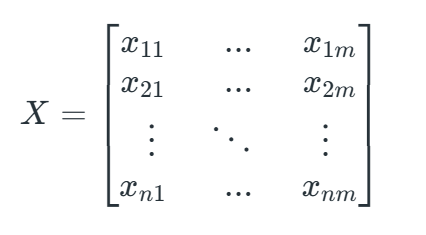
and the dependent variable is Y having only binary value i.e 0 or 1. 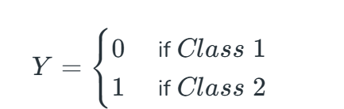
then, apply the multi linear function to the input variables X : 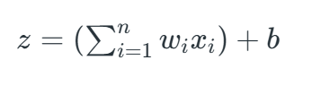
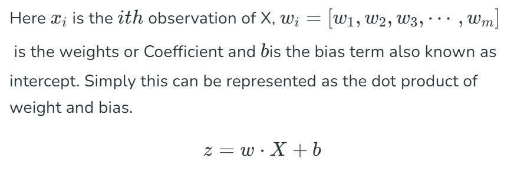
At this stage, z is a continuous value from the linear regression. Logistic regression then applies the sigmoid function to z to convert it into a probability between 0 and 1 which can be used to predict the class.
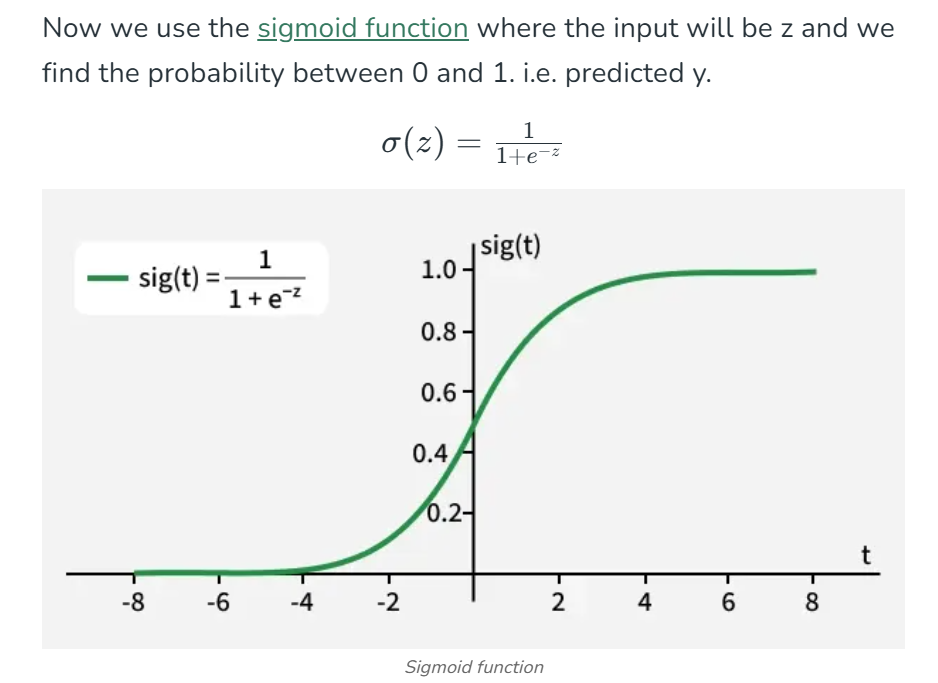
- as shown above the sigmoid function converts the continuous variable data into the probability i.e between 0 and 1. 
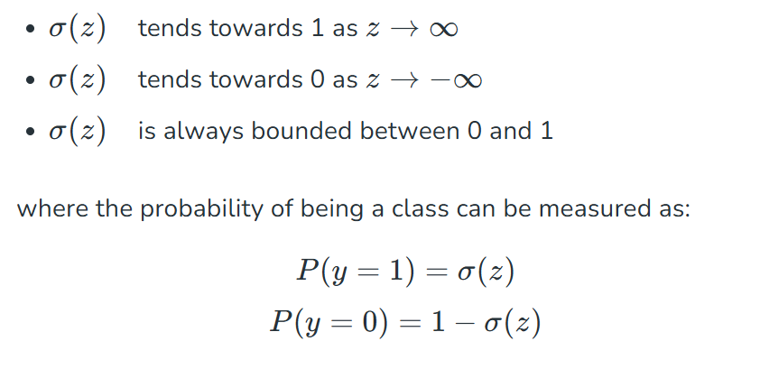

### Logistic regression equation and odds : 
it models the odds of the dependent eventt occuring which is the ratio of the probability of the event to the probability of it not occuring : 
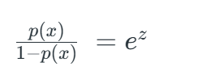

- taking the natural logarithm of the odds gives the log-odds or logit : 
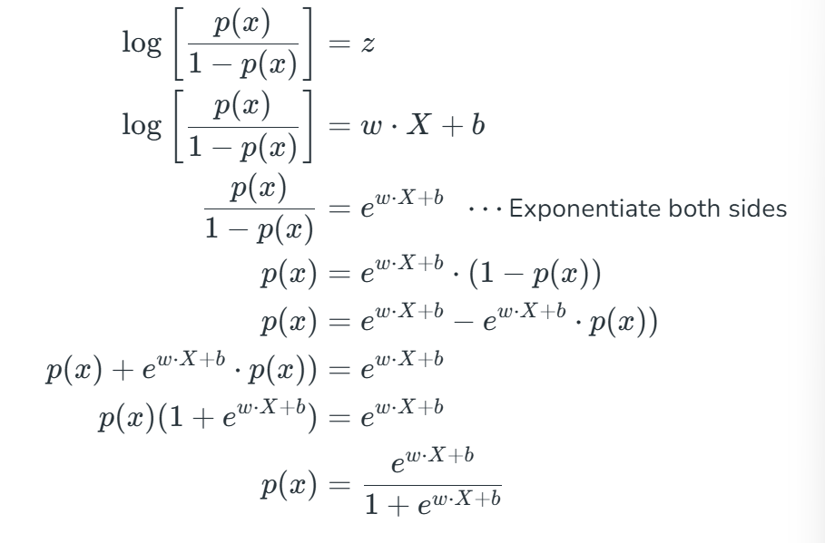
- then the final logistic regression equation will be :
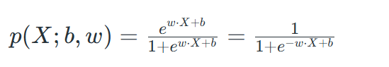
this formula represents the probability of the input belonging to class 1. 

### Likelihood function for logistic regression : 
the goal is to find weights w and bias b that maximize the likelihood of observing the data. 
 
for each data point i : 

- for y=1 , predicted probabilities will be : p(X;b,w) =p(x)p(x)
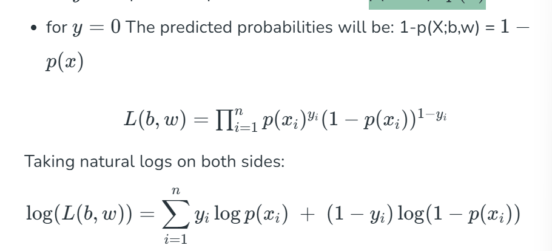
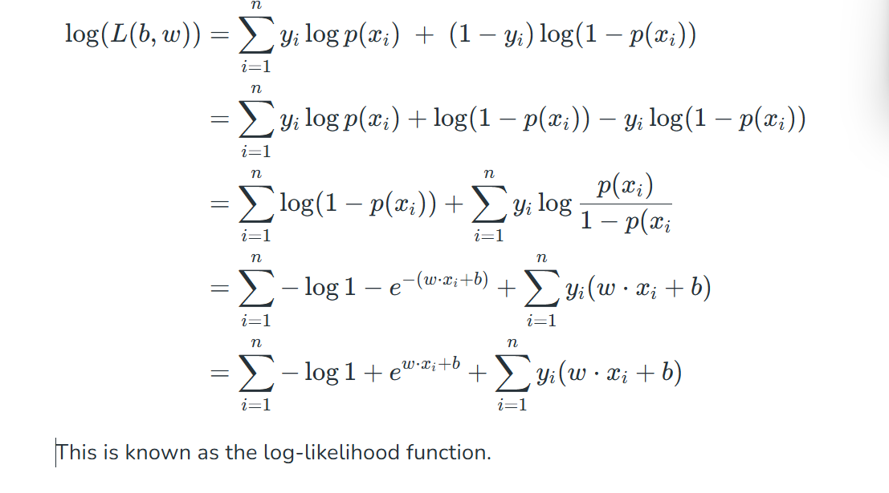

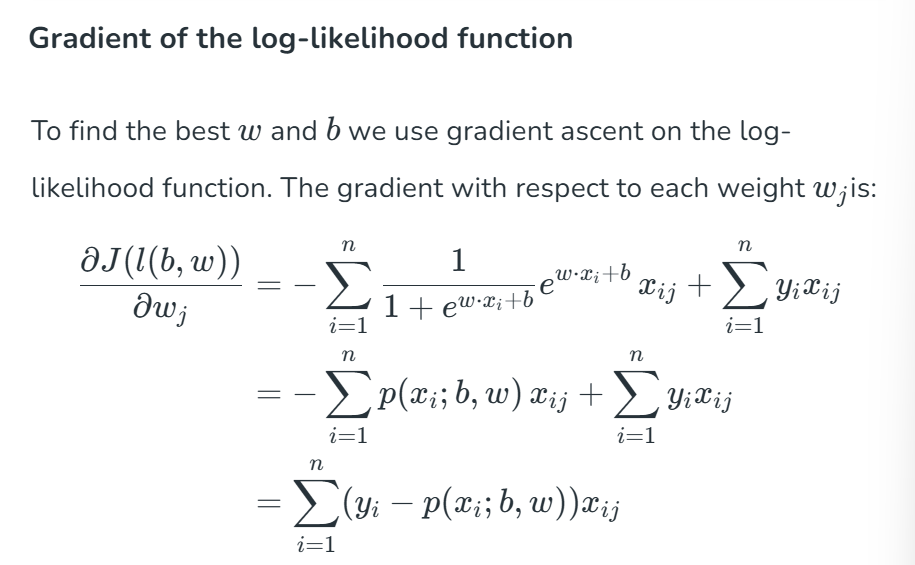

## Terminologie used : 
1. Independent variables : These are the input features or predictor variables used to make predictions about the dependent variable 
2. Dependent variable : This is the target variable that we aim to predict. In logistic regression, the dependent variable is categorical. 
3. Odds: This is the ratio of the probability of an event happening to the probability of it not happening. It differs from probability because probability is the ratio of occurences to total possibilities. 
4. Log-odds(Logit) : the natural logarithm of the odds. In logistic regression, the log-odds are modeled as a linear combination of the independent variables and the intercept 
6. Coefficient : these are the parameters estimated by the logistic regression model which shows how strongly the independent variables affect the dependent variable. 
7. Intercept : the constant term in the logistic regression model which represents the log-odds when all independent  variables are equal to zero. 
8. Maximum likelihood estimation (MLE) : this method is used to estimate the coefficients of the logistic regression model by maximizing the likelihood of observing the given data. 
## Evaluation metrics for logistic regression : 
evaluating the logistic regresison model helps assess its performance and ensure it generalizes well to new , unseen data
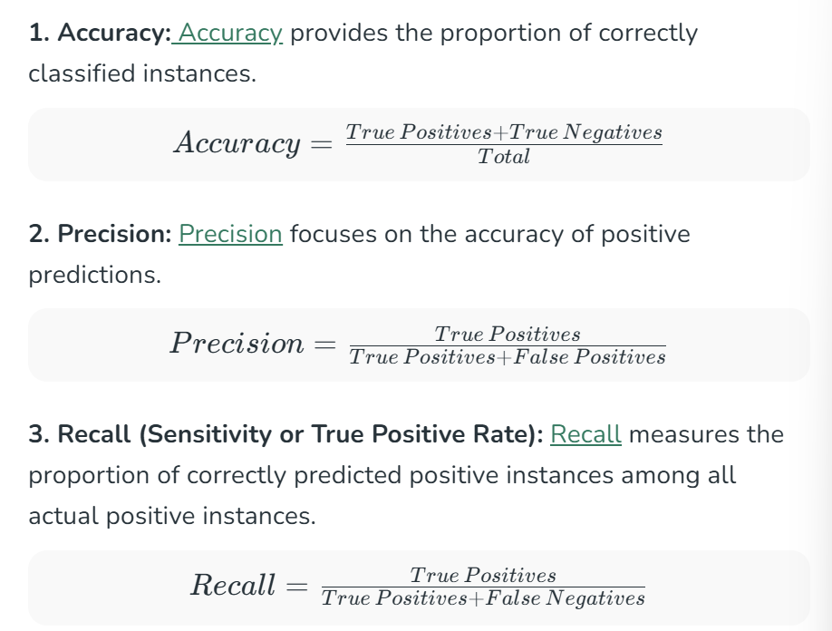
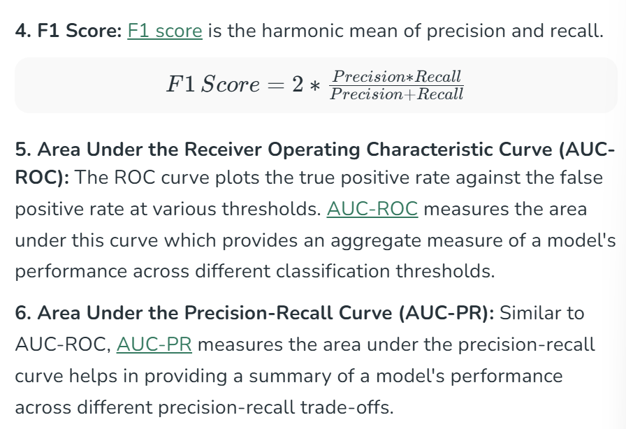