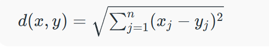
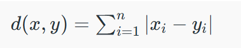
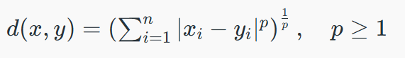
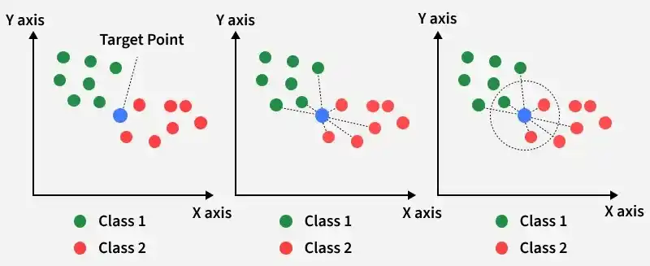

# K NEAREST NEIGHBOR ALGORITHM 

KNN is a simple and widely used machine learning technique for classification and regression tasks. It works by identifying the k closest data point to a given inputt and making predictions based on the majority class or average value of those neighbors. 
- classifies data based on similarity with nearby data points. 
- uses distance metrics like euclidean distance to find nearest neighbors
- since knn makes no assumptions about the underlying data distribution. It makes it a non-parametric and instance based learning method. 

 
KNN is called a lazy learning algorithm because it does not learn from the training set immediately instead it stores the entire dataset and performs computations only at the time of classification. 
 
For example consider two features i.e category 1 and category 2: 

- KNN assigns the category based on the majority of nearby points. The image shows how KNN predicts the category of a new data point based on its closest neighbours.
- The green points represent Category 1 and the red points represent Category 2.
- The new data point checks its closest neighbors (circled points).
- Since the majority of its closest neighbors are red points (Category 2) KNN predicts the new data point belongs to Category 2.
 
KNN works by using proximity and majority voting to make predictions. 

## K in KNN : 
in the KNN algorithm k is just a number that tells the algorithm how many nearby points or neighbors to look at when it makes a decision. 
 
Example : Imagine you're deciding which fruit it is based on its shape and size. You compare it to fruits you already know. 

### How to choose the value of k for KNN algorithm ? 
- the value of k in KNN decides how many neighbors the algorithm looks at when making a prediction.
- choosing the right K is important for good results. 
- if the data has lots of noise or outliers, using a larger k can make the predictions more stable. 
- but if k is too large the model may become too simple and miss important patterns and this is called underfitting.
- so k should be picked carefully based on the data 
### statistical methods for selecting K : 
- cross validation : is a good way to find the best value of k is by usingg k-fold cross validation. This means dividing the dataset  into k parts. The model is traned on some of these parts and tested on the remaining ones. this process is repeated for each part. 
- Elbow method : in ELBOW METHOD we draw a graph showing the error rate or accuracy for different k values. As k increases the error usually drops at first. But after a certain point error stops decreasing quickly. The point where the curve changes direction and looks like an elbow is usually the best choice for k 
- Odd Values for k: It’s a good idea to use an odd number for k especially in classification problems. This helps avoid ties when deciding which class is the most common among the neighbors.

## Distance Metrics used in KNN algorithm : 
KNN uses distance metrics to identify nearest neighbor, these neighbors are used for classification and regression task. to identify nearest neighbor we use below distance metrics :
1. Euclidean distance : Euclidean distance is defined as the straight-line distance between two points in a plane or space. You can think of it like the shortest path you would walk if you were to go directly from one point to another

2. Manhatten distance : This is the total distance you would travel if you could only move along horizontal and vertical lines like a grid or city streets. It’s also called "taxicab distance" because a taxi can only drive along the grid-like streets of a city.

3. Minkowski Distance
Minkowski distance is like a family of distances, which includes both Euclidean and Manhattan distances as special cases. 

From the formula above, when p=2, it becomes the same as the Euclidean distance formula and when p=1, it turns into the Manhattan distance formula. Minkowski distance is essentially a flexible formula that can represent either Euclidean or Manhattan distance depending on the value of p.
## working of KNN algorithm :

Thе KNN algorithm operates on the principle of similarity where it predicts the label or value of a new data point by considering the labels or values of its K nearest neighbors in the training dataset.

### Step 1: Selecting the optimal value of K

K is the number of nearest neighbors considered for the prediction. 
### Step 2: Calculating distance
To measure the similarity between target and training data points Euclidean distance is widely used. Distance is calculated between data points in the dataset and target point.
### step 3 : Finding Nearest neighbors : 
The k data points with the smallest distances to the target point are nearest neighbors.
### step 4 : voting for classification or taking average for regression 
- When you want to classify a data point into a category like spam or not spam, the KNN algorithm looks at the K closest points in the dataset. These closest points are called neighbors. The algorithm then looks at which category the neighbors belong to and picks the one that appears the most. This is called majority voting.
- In regression, the algorithm still looks for the K closest points. But instead of voting for a class in classification, it takes the average of the values of those K neighbors. This average is the predicted value for the new point for the algorithm.
 
It shows how a test point is classified based on its nearest neighbors. As the test point moves the algorithm identifies the closest 'k' data points i.e. 5 in this case and assigns test point the majority class label that is grey label class here.