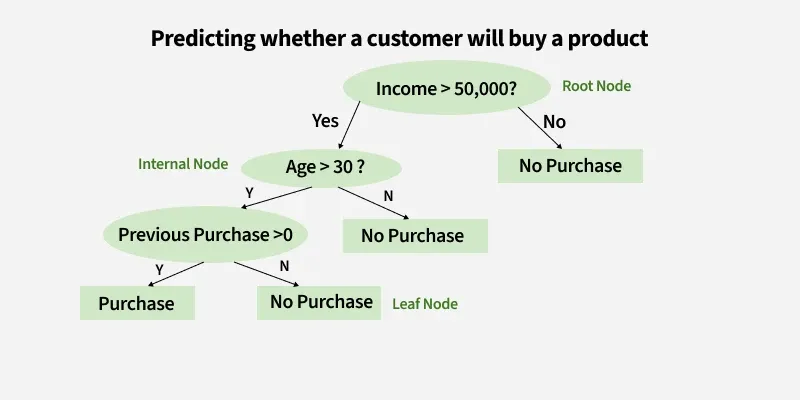
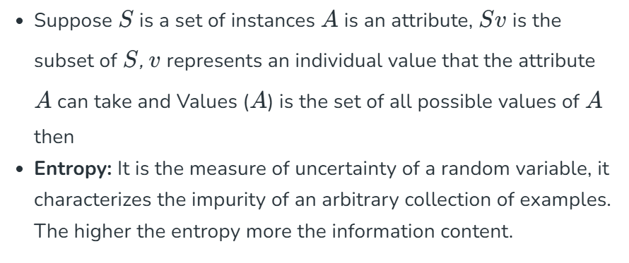
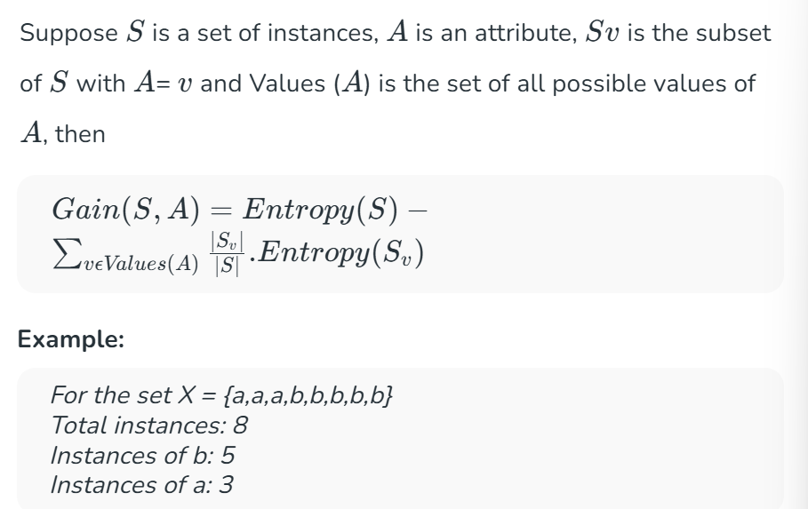
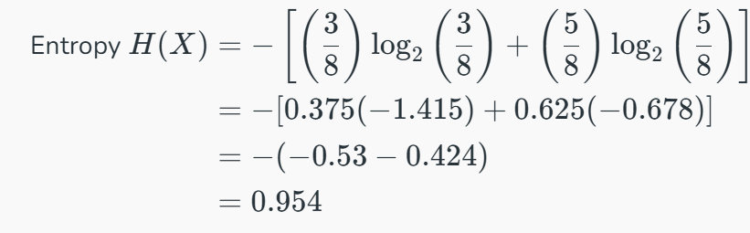
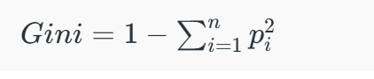

# Decision Tree in Machine Learning

A decision tree is a supervised learning algorithm used for both classification and regression tasks. Itt has a hierarchical tree structure which consists of a root node, branches, internal nodes and leaf nodes. It works like a flowchart that helps in making step-by-step decision , where : 
- internal nodes represent attribute tests. 
- Branches represent attribute values
- Leaf nodes represent final decisions or predictions 

  
Decision trees are widely used due to their interpretability, flexibility and low preprocessing needs. 

## How does a decision tree work : 
A decision tree splits the dataset based on feature values to create pure subsets ideally all items in a group belong to the same class. Each leaf node represents the final output, which can be a class label(in classification) or continuous value(in regression). : 

## information gain and gini index in decision tree : 
Moving to the attribute selection measure of decision tree. We have two popular attribute selection measures used : 
### 1. Information gain
 tells us how useful a question(or feature) is for splitting data into groups. It measures how much the uncertainty decreases after the split. A good question will create clearer groups and the feature with the highest information gain is choses to make the decision. 
- for example if we split a datasetof people into Young and Old based on age and all young people bought the product while all old people did not, the information gain would be high because the split perfectly separates the two groups with no uncertainty left. 

For example if a dataset has an equal number of Yes and No outcomes (like 3 people who bought a product and 3 who didn't) the entropy is high because it's uncertain which outcome to predict. But if all outcomes are the same(all Yes or All No) the entropy is 0 meaning there is no uncertainty left in predicting the outcome.

### building Decision tree using information gain the essentials : 
- start with all training instances associated with the root node. 
- use info gain to choose which attribute to label each node with.
- Recursively construct each subtree on the subset of training instances that would be classified down that path in the tree
- if all positive or all negative training instances remain, the label that node yes or no accordingly 
- if no attributes remain label with a majority vote of training instances left at that node
- if no instances remain label with a majority vote of the parent's training instances. 

## 2. Gini index : 
is a metric to measure how often a randomly chosen element would be incorrectly identified. It means an attribute with a lower Gini index should be preferred. Sklearn supports “Gini” criteria for Gini Index and by default it takes “gini” value.

For example if we have a group of people where all bought the product (100% "Yes") the Gini Index is 0 indicate perfect purity. But if the group has an equal mix of "Yes" and "No" the Gini Index would be 0.5 show high impurity or uncertainty. Formula for Gini Index is given by :

some additional features of the gini index : 
1. It is calculated by summing the squared probabilities of each outcome in a distribution and subtracting the result from 1.
2. A lower Gini Index indicates a more homogeneous or pure distribution while a higher Gini Index indicates a more heterogeneous or impure distribution.
3. Gini Index is used to evaluate the quality of a split by measuring the difference between the impurity of the parent node and the weighted impurity of the child nodes.
4. Compared to other impurity measures like entropy, the Gini Index is faster to compute and more sensitive to changes in class probabilities.
5. One disadvantage of the Gini Index is that it tends to favour splits that create equally sized child nodes, even if they are not optimal for classification accuracy.
6. In practice the choice between using the Gini Index or other impurity measures depends on the specific problem and dataset and requires experimentation and tuning.
## understanding decision tree with real life use case :
Till now we have understood about the attributes and components of decision tree. Now lets jump to a real life use case in which how decision tree works step by step.
### Step 1. Start with the Whole Dataset
we begin with all the data which is treated as the root node of the decision tree.
### Step 2. Choose the Best Question (Attribute)
Pick the best question to divide the dataset. For example ask: "What is the outlook?"

Possible answers: Sunny, Cloudy or Rainy.

### Step 3. Split the Data into Subsets
Divide the dataset into groups based on the question : 
- if sunny go to one subset
- if cloudy go to another subset 
- if rainy go to the last subset
### step 4 : Split further if needed (recursive splitting) 
For each subsett ask another question to refine the groups. For example if the sunny subset is mixed ask 
"is the humidity high or normal ? "
- High humidity → "Swimming".
- Normal humidity → "Hiking".

### step 5 : assign final decisions(Leaf Nodes): 
when a subset contains only one activity, stop splitting and assign it a label 
- Cloudy → "Hiking".
- Rainy → "Stay Inside".
- Sunny + High Humidity → "Swimming".
- Sunny + Normal Humidity → "Hiking".
### step 6 : use the tree for predictions : 
To predict an activity follow the branches of the tree. Example: If the outlook is Sunny and the humidity is High follow the tree:

- Start at Outlook.
- Take the branch for Sunny.
- Then go to Humidity and take the branch for High Humidity.
- Result: "Swimming".