# Support vector machine algorithm : 
SVM is a supervised machine learning algorithm used for classification and regression tasks. It tries to find the best boundary known as hyperlane that separates different classes in the data. It is useful when you want to do binary classification like spam vs no spam ... 
- the main goal of SVM is to maximize the margin between the two classes. The larger the margin the better the model performs on new and unseen data.

## Key concepts : 
- Hyperplane : A decision boundary separating different classes in feature space and is represented by the equation wx+b=0 in linear classification.
- support vectors : the closest data points to the hyperplane; crucial for determining the hyperplane and margin in SVM 
- Margin : the distance between the hyperplane and the Support vectors. SVM aims to maximize this margin for better classification performance. 
- Kernel : a function that maps data to a higher dimensional space enabling SVM to handle non-linearity separable data.
- hard Margin: A maximum-margin hyperplane that perfectly separates the data without misclassifications.
- Soft Margin: Allows some misclassifications by introducing slack variables, balancing margin maximization and misclassification penalties when data is not perfectly separable.
- C: A regularization term balancing margin maximization and misclassification penalties. A higher C value forces stricter penalty for misclassifications.
- Hinge Loss: A loss function penalizing misclassified points or margin violations and is combined with regularization in SVM.
- Dual Problem: Involves solving for Lagrange multipliers associated with support vectors, facilitating the kernel trick and efficient computation.

## Working of Support vector machine learning: 
The key idea behind the SVM algorithm is to find the hyperplane that best separates two classes by maximizing the margin between them. This margin is the distance from the hyperplane to the nearest data points (support vectors) on each side. 
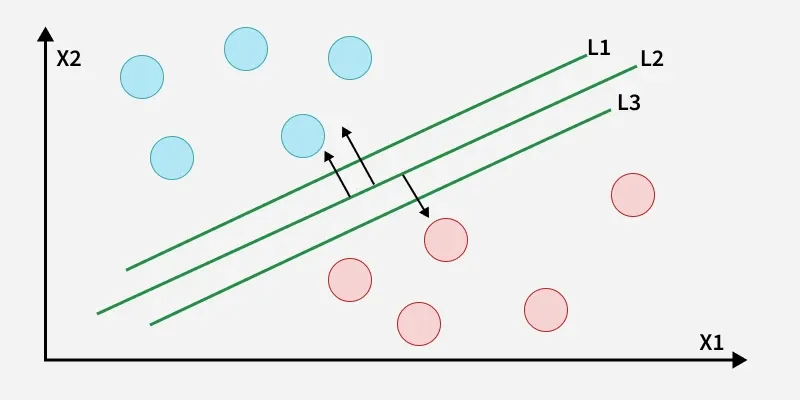
the best hyperplane also known as the hard margin is the one that maximized the distance between the hyperplane and the nearest data points from both classes. This ensures a clear separation between the classes. So from the above figure we choose L2 as hard margin. Let's consider a scenarion like shown below : 
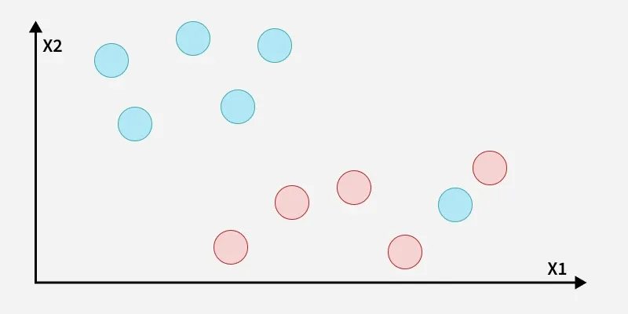
here we have one blue ball in the boundary of the red ball. 
### how does SVM classify the data ? 
The blue ball in the boundary of red ones is an outlier of blue balls. The SVM algorithm had the charactersitics to ignore the outlier and finds the best hyperplane that maximizes the margin. SVM can be sensitive to outliers, especially in the case of a hard margin, while soft margin SVM helps reducec their impact by allowing some misclassifications.
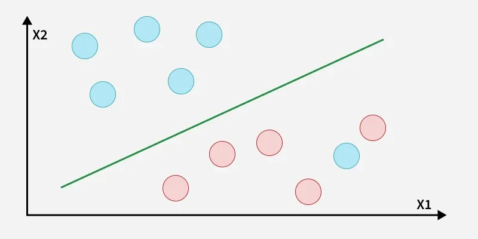
a soft margin allows for some misclassifications or violations of the margin to improve generalization. The SVM optimizes the following equation to balance margin maximization and penalty minimization : 
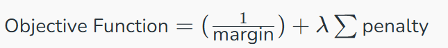
The penalty used for violations is often hinge loss which has the following behavior : 
- If a data point is correctly classified and lies outside the margin, there is no penalty (loss = 0). If it is correctly classified but lies within the margin or is misclassified, the hinge loss is greater than 0.
- If a point is incorrectly classified or violates the margin the hinge loss increases proportionally to the distance of the violation.
 
Till now we were talking about linearly separable data that separates group of blue balls and red balls by a straight line/linear line. 

## What if data is not linearly separable ? 
when data is not linearly separable i.e it can't be divided by a straight line, SVM uses a technique called kernels to map the data into a hugher-dimensional space where it becomes separable. This transformation helps SVM find a decision boundary even for non-linear data.  
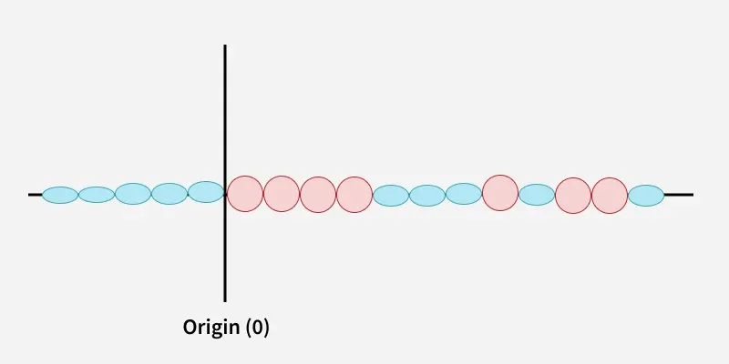
kernel is a function that maps data points into a higher dimensional space without explicitly computing the coordinates in that space. This allows SVM to work efficiently with non linear data by implicitly performing the mapping. For example consider data points that are not linearly separable. By applying a kerner function SVM transforms the data points into a higher dimensional space where they become linearly separable. 
- Linear Kernel: For linear separability.
- Polynomial Kernel: Maps data into a polynomial space.
- Radial Basis Function (RBF) Kernel: Transforms data into a space based on distances between data points.
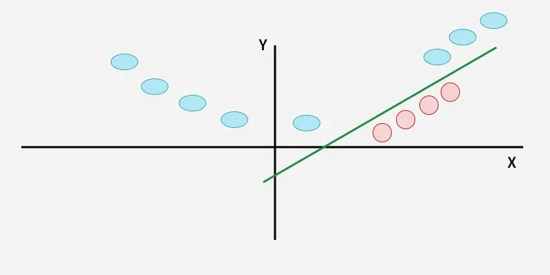
In this case the new variable y is created as a function of distance from the origin. 
## Mathematical computation of SVM : 
Consider a binary classification problem with two classes, labeled as +1 and -1. We have a training dataset consisting of input feature vectors X and their corresponding class labels Y. The equation for the linear hyperplane can be written as: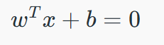
where : 
- w is the normal vector to the hyperplane (the direction perpendicular to it)
- b is the offset or bias term representing the distance of the hyperplane from the origin along the normal vector w.
### distance from a data point to the hyperplane : 
the distance between a data point xi and the decision boundary can be caculated as : 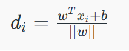
where ||w|| represents the Euclidean norm of the weight vector w.

### Linear SVM classifier : 
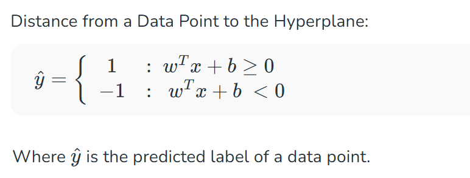
### optimization problem for SVM : 
For a linearly separable dataset the goal is to find the hyperplane that maximizes the margin between the two classes while ensuring that all data points are correctly classified. This leads to the following optimization problem:
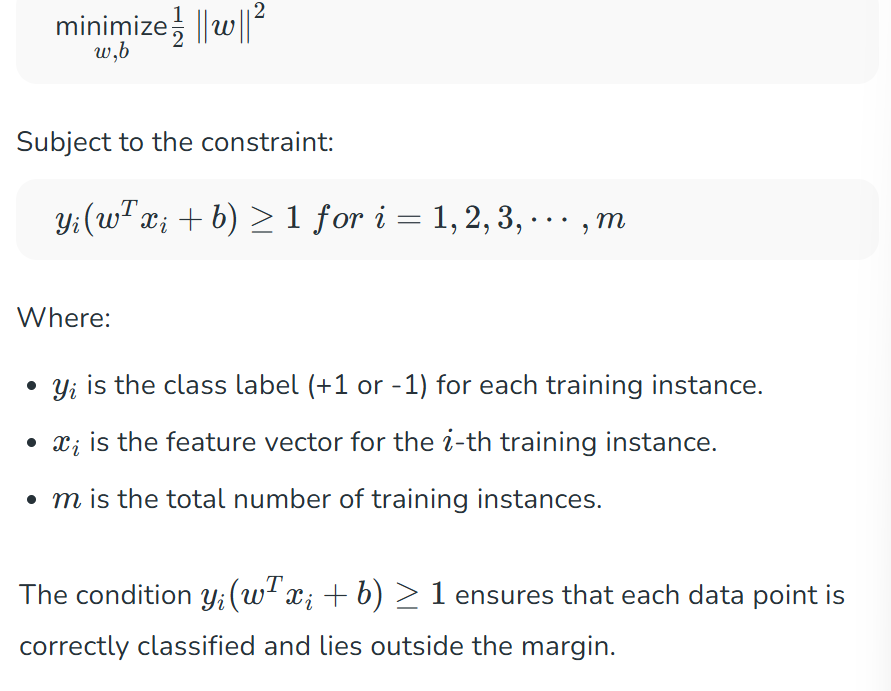
### soft margin in linear SVM classifier : 
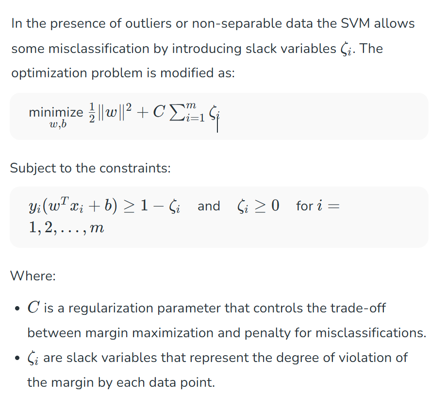

### dual problem for SVM : 
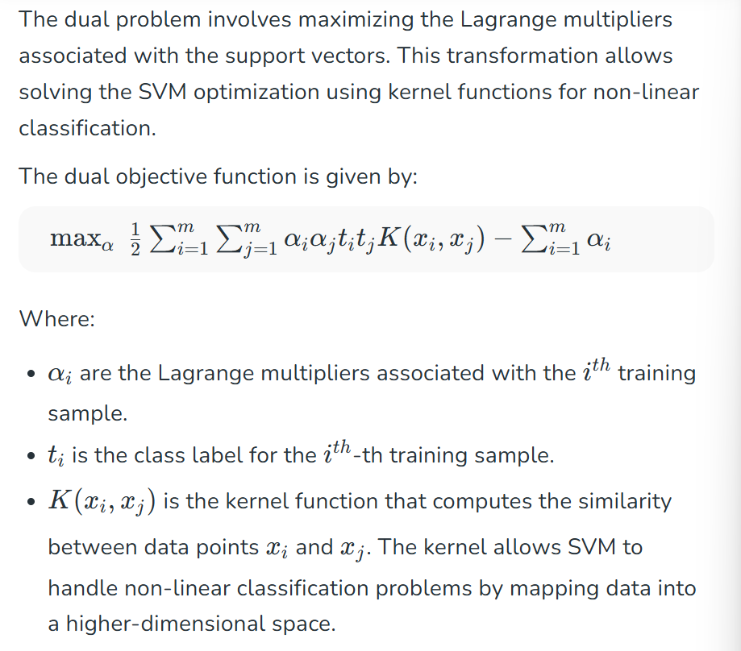
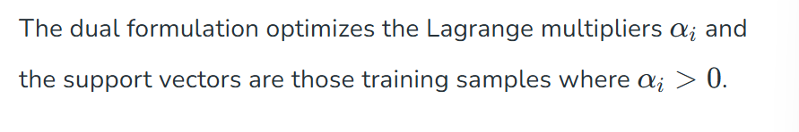

### SVM decision boundary 
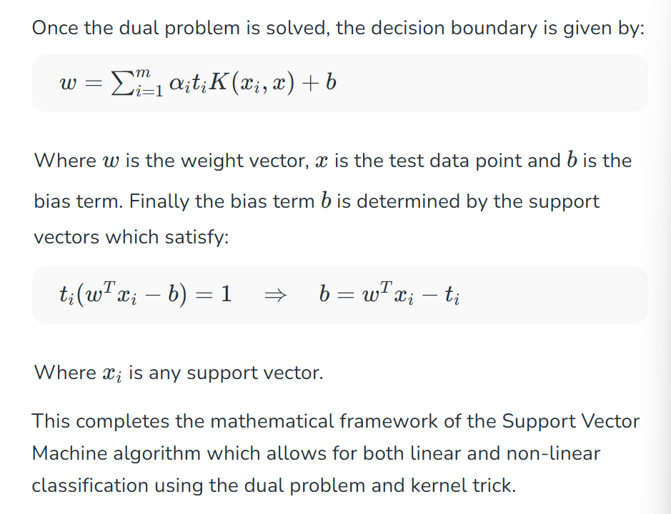

## types of SVM : 
based on the nature of the decision boundary , SVM can be divided into two main parts : 
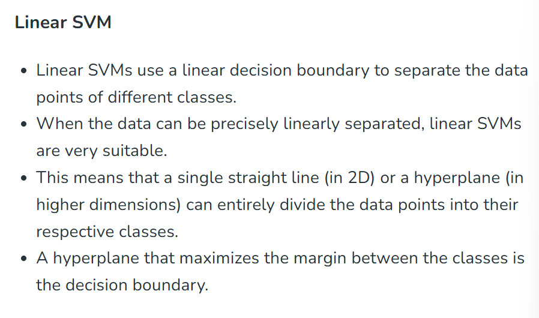
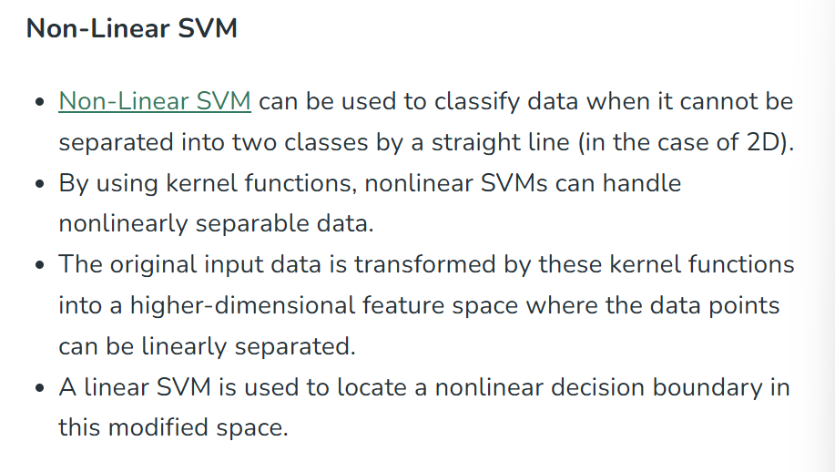

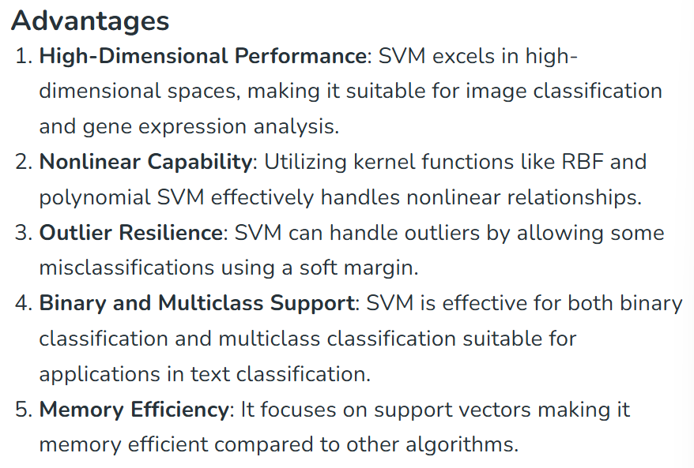
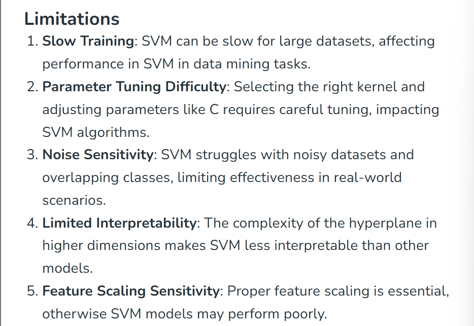