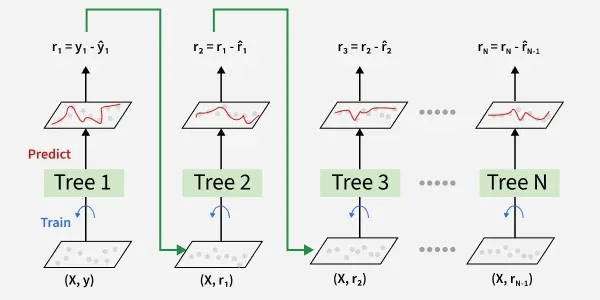
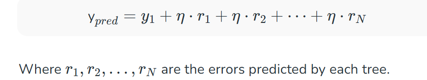

# GRADIENT BOOSTING : 

GB is a boosting algorithm and here each new model is trained to minimize the loss function such as mean squared error or cross-entropy of the previous model using gradient descent. In each iteration the algorithm computes the gradient of the loss function with respect to predictions and then trains a new weak model to predict this gradient. Predictions of the new model are then added to the ensemble(all models prediction) and the process is repeated until a stopping criterion is met. 

## Shrinkage and model complexity : 
A key feature of Gradient boosting is shrinkage which scales the contribution of each new model using learning rate(denoted as η).
- Smaller learning rates: mean the contribution of each tree is smaller which reduces the risk of overfitting but requires more trees to achieve the same performance.
- Larger learning rates: mean each tree has a more significant impact but this can lead to overfitting.
 
There's a trade off between the learning rate and the number of estimators (trees) a smaller learning rate usually means more trees are required to achieve optimal performance.

## working of gradient boosting : 
### 1. Sequential Learning Process
The ensemble consists of multiple trees each trained to correct the errors of the previous one. In the first iteration Tree 1 is trained on the original data x and the true labels y. It makes predictions which are used to compute the errors.
### 2. Residuals Calculation
In the second iteration Tree 2 is trained using the feature matrix 
x and the errors from Tree 1 as labels. This means Tree 2 is trained to predict the errors of Tree 1. This process continues for all the trees in the ensemble. Each subsequent tree is trained to predict the errors of the previous tree.

### 3. Shrinkage
After each tree is trained its predictions are shrunk by multiplying them with the learning rate η which ranges from 0 to 1. This prevents overfitting by ensuring each tree has a smaller impact on the final model.

Once all trees are trained predictions are made by summing the contributions of all the trees. The final prediction is given by the formula:
