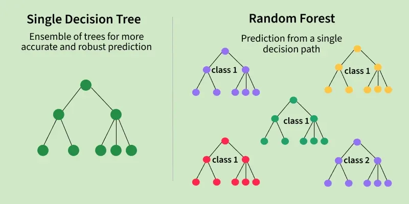
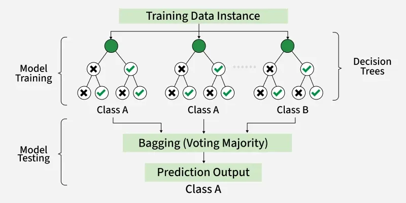
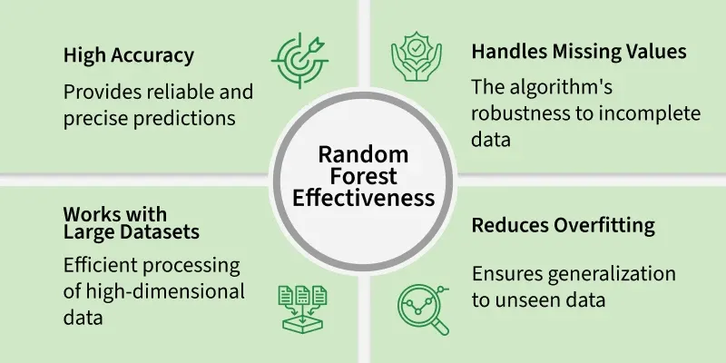

# Random Forest algorithm in machine learning
Random forest is a machine learning algorithm that uses many decision trees to make better predictions. Each tree looks at different random parts of the data and their results are combined by voting for classification or averaging for regression which makes it as ensemble learning technique. This helps in improving accuracy and reducing errors. 

# working of random forest : 

- create many decision trees : the algorithm makes many decision trees each using a random part of the data. so every tree is a bit different. 
- pick random features : when building each tree it doesnt look at all the features(columns) at once. It picks a few at random to decide how to split the data. This helps the trees stay different from each other 
- Each tree makes a prediction : Every tree gives its own answer or prediction based on what it learned from its part of the data 
- combine the predictions : for classification , the final answer is the category that most trees vote for(majority voting)

## Key features of random forest : 
- handles missing data : works only after preprocessing, as most implementations like scikit-learn do not support missing values directly 
- shows feature importance : it tells you which features(columns) are most useful for making predictions which helps you understand your data better 
- works well with big and complex data : it handle large datasets with many features without slowing down or losing accuracy 
- used for different tasks : you can use it for both classification like predicting types or labels and regression like predicting numbers or amounts

## assumptions of random forest : 
- Each tree makes its own decisions : every tree in the forest makes its own predictions without relying on others 
- Random parts of the daa are used : each tree is built using random samples and features to reduce mistakes 
- enough data is needed : sufficient data ensures the trees are different and learn unique patterns and variety
- Different predictions improve accuracy : combining the predictions from different trees lead to a more accurate final result. 

### advantages : 
- Random Forest provides very accurate predictions even with large datasets.
- Random Forest can perform well after handling missing data through preprocessing techniques like imputation.
- It doesn’t require normalization or standardization on dataset.
- When we combine multiple decision trees it reduces the risk of overfitting of the model.
### limitations : 
- It can be computationally expensive especially with a large number of trees.
- It’s harder to interpret the model compared to simpler models like decision trees.